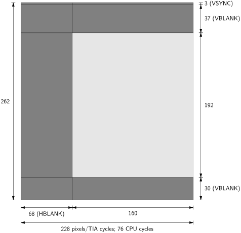

# The TIA coprocessor

[TOC]

The TIA (*Television Interface Adapter*) coprocessor generates the Atari 2600 graphics and audio and handles some of the IO ports. The TIA programmer manual provides only an informal description of the TIA behaviour. An accurate emulation requries tequires an in-depth analysis of the TIA schematics, carried out in this document.

This page provides a high-level overview of the TIA. Specific topics are addressed in the following pages:

- [TIA hardware modules](TIA_Modules.md)
- [TIA bus and registers](TIA_Bus_Registers.md)
- [TIA input and output ports](TIA_Ports.md)
- [TIA visual objects](TIA_Visual_Objects.md)
- [TIA composite signal generation](TIA_Composite.md)
- [TIA sound](TIA_Sound.md)
- [TIA simulation](TIA_Simulation.md)

## Overview

In the Atari 2600, the TIA generates the CPU clock, the video, the sound, and handles some of the input and output ports. In order to generate the graphics, the TIA procues a *composite video signal* for a cathode-tube television (TV) set. Since cathode-tube TVs draw one pixel at a time, from left to right and top to bottom, the TIA serializes the graphics in the same manner.

Aiming for a cheap design, the TIA does not directly access the system memory; instead, the M6507 CPU in the Atari 2600 must provide the graphics data to the TIA just in time for it to be displayed. The CPU program must then work in sync with the TIA and the cathode-tube electron beam to draw the image, a process informally referred to as *racing the beam*.

### The display

The TIA exists in several versions, targeting the NTSC, PAL, and SECAM video standard, and a few revisions. In the NTSC version, which is analyized in this document, the TIA main clock `CLK` frequency matches the *NTSC color carrier frequency* of 315/88 = 3.57954 MHz, and is thus called **color clock**.

The TV set draws frames from top to bottom as a sequnce of **scanlines**, and draws each scanline from left to right. It does so by aminig the cathode-tube electron beam at different screen locations, scanning them in a fixed order. The  *intesity* of the elctron beam is modulated to draw the desired pattern, with high intensity corresponding to brighter colors and low intensity to darker colors. The beam can also be switched off entirely between scaline and between frames to allow the beam to move from right to left and from bottom to top without drawing artifacts.

TV sets are analogue devices and as such do not have discrete pixels. However, the color carrier frequency provides an upper bound on how quickly colors can be changed as the scanline is drawn. Hence, the TIA defines a pixel to have the duration equal to a color clock period.

In this manner, the display is organised as a rectangular array of pixels. Each scanline contains a row of pixels and lasts for 228 color clock periods, of which only the last 160 correspond to visible pixels. A frame (nominally) comprises 262 scanlines. This situation is illustrated below:

The TIA also generates the **CPU clock** $\Phi_0$ at 1/3 of the color clock frequency (hence the CPU clock is of about 1.2 MHz). The CPU and TIA are synchronized such that the first TIA cycle in a scanline corresponds to the beginning of a CPU cycle. Hence, a scanline contains exactly $228/3=76$ CPU cycles.

The composite TV signal contains various synchronisation signals that define the beginning of each frame and of each scanline. Starting from the latter, the TIA generates automatically, with a period of one scaline, the horizonal sync (`HSYNC`) signal, which causes the cathode tube to reposition the beam to the let of the screen. The horizontal sync signal is generated during a period of time called **horizontal blank** (`HBLANK`) where the beam is switched off. In this manner, as the beam is moved back, nothing is drawn on screen. Horizontal blanking lats for 68 pixels (resulting in $228-68=160$ visible pixels), but it is sometimes extended to $76=68+8$ pixels by the `HMOVE` feature, as explained later in the document.

Vertical positioning is similar, but it is done in response to instructions from the CPU rather than automatically. Towards the end of the frame the CPU switches off the beam by writing to the **vertical blank**  (`VBLANK`) register of the TIA (this register is sometimes abused to draw black areas in a picture). The, the CPU sets the `VSYNC` register  to start generating the vertical sync signal, which moves the beam to the top of the screen. After waiting a certain amount of time (TODO), the CPU stops generating the vertical sync signal and reactivates the beam by writing again to`VSYNC` and `VBLANK`.

In this manner, the CPU is in control of the vertical synchronization of the cathode beam, so it knows when a new frame starts. However, the TIA is in charge of timing the individual scanlines; the CPU can synchronise to the beginning of a scanline by reading from the `WSYNC` register. The latter causes the TIA to stall the read operation until a new scanline starts (the M6507 CPU allows read operations to stall).

### Pinout, bus and clock

The TIA pinout is as follows:

The TIA is **powered** by the 5V `VCC` line and connected to **ground** at `VSS`.

The TIA is clocked by an external oscillator `OSC` that generates its master clock `CLK`, known as **color clock**. The TIA derives from this clock the **CPU clock** $\Phi_0$ and the CPU in turns generates the **bus clock** $\Phi_2$, fed back into the TIA to synchronize the bus.

The CPU  writes or reads the TIA registers using the 6-bit **address bus**  `A0-5`  and the 8-bit **data bus** `D0-7`. Write and read operations affect different registers, so that the **read-write** line `RW` can be considered an additonal address bit. The CPU writes data to the TIA when `Rw` is high. The four **chip select** `CSx` lines must satisfy the condition `CS[0:3]=0010` to address the TIA in an input-output operation. The address and register implementation is described in detail in the [TIA Bus and registers](TIA_Bus_Registers.md) section.

The six output lines `CSYNC`, `LUM0-2`, `COLOR`, `BLKnot` encode video information and are mixed (using a resistor network in the console motherboard) to form the **composite video** signal. The `CADJ` line is connected to a potentiometer to tweak the generation of the chroma component of the composite video signal.

The two output lines `AUD0-1` encode the **audio**. These are also mixed in the composite video signal, as the latter carries sound as well.

The lines `P0-3` are used as **input ports** and `T0-1` as **input ports**. The implementation of these ports is discussed in the [TIA input ports](TIA_Ports.md) section.

### Underlying technology

The TIA contains several sub circuits in charge of generating different graphic objects and the audio. These build in a number of basic components, discussed in some details in the [TIA hardware modules](TIA_Modules.md) section.

### Graphics

The TIA generates the console graphics semi-automatically by means of six (very basic) **visual objects ** plus background. Objects are monochromatic: at each pixel, any of the object can be on or off. If an object is on, the corresponding color is rendered on screen. If all objects are off, then the background color is shown. If two or more objects are visibile at the same time, one has a  **collision**; this is recorded (to detect when two objects overlap) and the resulting color is obtained by means of a priority encoder.

The circuitry is discussed in detail in the [visual object](TIA_Visual_objects.md) section and the [composite video](TIA_Composite.md) section and the main facts are briefly summarized next.

#### Positioning

The CPU implicitly positions the visual objects (ball, missiles, and players) **vertically** by enabling and disabling their visualization when the beam reaches the desired scanline. This is done by writing to one of the `ENAx ` registers (`ENABL`,  `ENAM0`,  `ENAM1`,  `GRP0`,  `GRP1`).

In order to position the visual objects **horizontally**, the CPU strobes one of the `RESx` registers (`RESBL`, `RESM0`, `RESM1`, `RESP0`, `RESP1`). This "immediately" resets an internal counter $C$ in the corresponding visual object. The counter is automatically incremented at each pixel and wraps around after a scanline worth of pixels has been counted. Whenever the counter reaches zero, a copy of the visual object is drawn.

This mechanism means that the CPU needs to strobe `RESx` when the raster beam is at the desired horizontal position. After that, the object will be drawn automatically at that location in subsequent scanlines. Missiles and players can in fact be configured to draw additional copies (controlled by bits in `NUSIZ0` and `NUSIZ1`) in correspondence of values of $C$ other than zero.

Since a CPU cycle lasts for 3 color cycles, this positioning method has a resolution of 3 pixels. Fine-tuning uses the `HMOVE` mechanism. The CPU writes an offset in the range  $[-7,+8]$ to the registers  `HMBL`, `HMM0`, `HMM1`, `HMP0`, `HMP1` and then strobes `HMOVE`. When a new scaling starts, the offsets are added to the counter $C$ of the corresponding visual objects, causing them to shift to the left or the right by the desired amount.

#### Registers

* The **background** color is set by writing to the register `COULBK`.
* The **playfield** is used to display fixed background graphics. Registers `PF0`, `PF1` and `PF2` hold 20 bits representing 20 playfield pixels, each expanded to 4 screen pixels. Hence the 20 playfield pixels fill exactly half of the visible scanline (80 screen pixels). For the second half, the pattern can be repeated as is or reflected (controlled by a bit in the `CTRLPF` register), for a total of 160 pixels. The register `COLUPF` controls the color of the playfield.
* The **ball** and **missiles** generate simple rectangular shapes that can be positioned anywhere along a scanline. The ball color is controlled by the register `COLUBL` and the missiles take the colors of the corresponding players. Both balls and missiles can have a width of 1, 2, 4, or 8 pixels, controlled respectively by certain bits in `CTRLPF` and `NUZIS0`, `NUSIZ1`.  They are enable and disabled by writing bits in `ENABL`,  `ENAM0`, and `ENAM1`. The emission of the ball graphic is also affected by bits in `VLDEBL` as explained later. They are positioned horizontally by strobing (writing a dummy value) registers `RESBL`, `RESM0` and `RESM1`.
* The **players** are the most advanced objects as they can display 8-bit worth of raster graphics. Their color is controlled by registers `COLUP0` and `COLUP1` . The graphics can be reflected (controlled by a bit in `REFP0` and `REFP1`) and, can be stretched so each pixel is expanded to 1, 2, 4, or 8 screen pixels (controlled by some bits in `NUSIZ0` and `NUSIZ1`). The graphic items is contained in registers `GRP0` and `GRP1` and affected by `VDELP0` and `VDELP1`. They are positioned horizontally by stropping `RESP0` and `RESP1`.
* When more than one object generate a pixel at the same time (i.e. they visually overlap), the collision is recorded in a bit of the **collision register**, which can be read at a later time from the registers `CX`.
