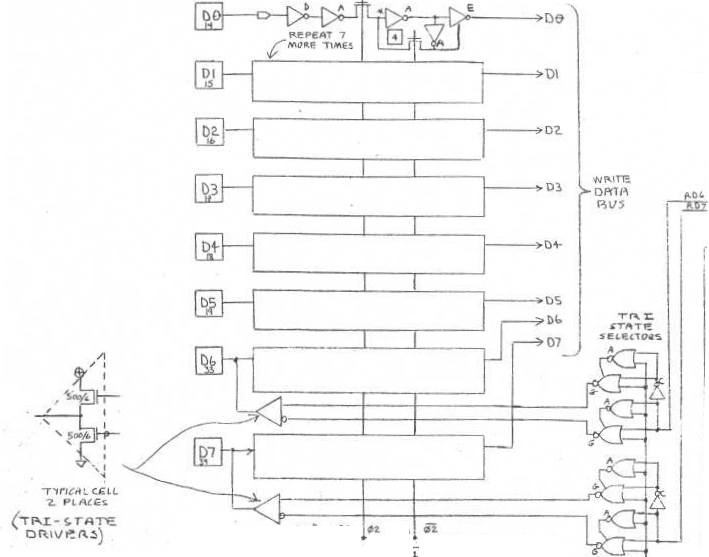

# TIA bus and registers

[TOC]

## Overview

The M6507 CPU communicates with the TIA using the address and data buses, the chip-select lines `CS`, the read/write line `RW` line, the `RDY` line, and the $\Phi_2$ clock, as follows:

**CPU writes to the TIA.** A write cycle looks as follows:

1. In the first half of the cycle (lasting for 1.5 TIA cycles), the CPU lowers $\Phi_2$, updates the address bus, lowers `RW` (to denote a write operation), and sets `CS` to select the TIA.
2. In the second half of the cycle, the CPU raises $\Phi_2$ keeping address bus,  `RW` and `CS` constant and updates the data bus. The TIA buffers for data (D), address (A) and  `Wnot`  are transparent while $\Phi_2=1$ and follow the new values on the bus.
3. The CPU drives $\Phi_2$ low again. The TIA data and address buffers lock. The address buffer is decoded in a strobe signal which, depending on the address, may cause a register's latch to follow (copy) the data buffer, updating the register.

*Remarks*: raising of a strobe and updating an internal register occur right after the CPU write cycle is entirely expired. The strobe then last for 1.5 TIA cycles. The `RDY` line has no effect during a write.

**CPU reads from the TIA.** A read cycle looks as follows

1. In the first half of the cycle, the CPU lowers $\Phi_2$, updates the address bus, raises `RW`  (to denote a read operation), and sets `CS` to select the TIA. 
2. In the second half of the cycle, the CPU raises $\Phi_2$ keeping address bus,  `RW` and `CS` constant, and leaves the data bus floating. The TIA buffers for address (A) and  `Wnot`  are transparent while $\Phi_2=1$ and follow the new values on the bus. Since `TSD` goes low, the tri-state buffers in the TIA drive pins `D6` and `D7` with the requested data (the other data pins are left floating). 

*Remarks*: the data is available to the CPU immediately at the beginning of its next cycle.

**CPU stall.** The TIA controls also the `RDY` pin, which, if low, causes the CPU to repeat the any current read cycle, stalling (write cycles are unaffected). This mechanism is used to synchronize the CPU to the beginning of a scanline: the CPU writes to the `WSYNC` register, triggering a strobe that sets the internal `WSYNC` latch which in turn causes `RDY` to go low in the CPU cycle following the write cycle. The latch is cleared when the next horizontal blank period begins (internally signaled by `SHB`).

## Modules

### Chip select `CS`, read-write `Rw`, phase $\Phi_2$

</img>

The pin `Phi2` takes the $\Phi_2$ tase generated by the CPU into the TIA through a buffer. An inverter generates $\bar\Phi_2$ from it.

The tri-state is enabled when `TSD` is low, namely when:
$$
\bar{\mathtt{TSD}} =\Phi_2 \wedge\neg(
\mathtt{CS}_0 \vee
\bar{\mathtt{CS}}_1\vee
\mathtt{CS}_2\vee
\mathtt{CS}_3\vee
\bar{\mathtt{RW}})
=
\Phi_2 \wedge (
\bar{\mathtt{CS}}_0 \wedge
\mathtt{CS}_1\wedge
\bar{\mathtt{CS}}_2\wedge
\bar{\mathtt{CS}}_3)\wedge
\mathtt{RW}
$$
The write latch `Wnot` is updated to the opposite of the logical condition
$$
\mathtt{W} = (\neg(
\mathtt{CS}_0 \vee \bar{\mathtt{CS}}_1\vee \mathtt{CS}_2\vee \mathtt{CS}_3) \wedge \bar{\mathtt{RW}}) 
= 
(\bar{\mathtt{CS}}_0 \wedge \mathtt{CS}_1\wedge \bar{\mathtt{CS}}_2\wedge \bar{\mathtt{CS}}_3) \wedge \bar{\mathtt{RW}}
$$

while $\Phi_2=1$ and held while $\Phi_2=0$.

### `RDY` line

</img>

The `RDY` line is controlled by a latch, set by the `WSYNC` strobe `WSYN` and cleared by the setting of horizontal blank `SHB`. More specifically, the set condition is $\mathtt{WSYN}\wedge\bar{\mathtt{SHB}}$ and the clear condition is $\mathtt{SHB}\wedge\mathtt{CLK}$.

*Remark*: there is a conflict  when the `WSYN` strobe and `SHB` turn on at the same time (hence at the beginning of a scanline). Since `SHB` masks `WSYN`, the latter has priority and `RDY` is cleared.

### Data buffers (D)

</img>

**Moving data from the bus (write).** Pins `D0-7` are connected to hold-follow latches with the same names. Follow is connected to clock $\Phi_2$ and hold to clock $\bar\Phi_2$. Hence the output follows `Dx`  while $\bar\Phi_2=1$ and then locked at the value at the raising edge of $\Phi_2$ while $\Phi_2=0$.

**Moving data to the bus (read).** Pins `D6-7` are also connected to tri-state buffers that, while signal `TSD` is raised, drive them from lines `RD6-7`. The other pins are not driven, which may leave them floating.

### Address buffers (A)

</img>

**Moving data from the bus (write).** Pins `A0-5` are connected to follow-hold latches with the same names, used for decoding a write operation. Follow is connected to clock $\Phi_2$ and hold to clock $\bar\Phi_2$. Hence the latches follow the data on the pin while $\Phi_2=1$ and lock to the value at the *falling* edge of $\Phi_2$ (at which point the address set by the CPU is valid), maintaining the value while $\Phi_2=0$.

**Moving data to the bus (read).** Pins `A0-3` are also directly (via a number of buffers) connected to lines `RA0-3`, used for decoding a read operation.

### Address decoding

</img>

**Moving data from the bus (write).** The buffered address bits `A0-5` as well as the buffered write line `Wnot` and $\Phi_2$ are matched by different patterns to generate corresponding strobe signals, such as `RESP0`, to update latches in response to write operations. Strobes are raised under the condition:
$$
\mathrm{strobe} = (\mathtt{A}[0\dots5] = \mathrm{address}) \wedge \mathtt{W} \wedge \bar\Phi_2
$$
The last condition is required because `A0-5 ` and  `Wnot` are valid only while $\Phi_2=0$.

Strobes trigger some action such as resetting a visual object position. Most frequently, they trigger the update of a register from the data buffer. For example, the `VBLK` strobe updates the `VBLANK` registers, consisting of three bits `VB`, `LATCHnot` and `DUMP` connected to data bits `D1`, `D6` and `D7`:

</img>

The follow-hold latch is in turn connected to `VBLK` (follow) and its negation (hold). This causes the register to update its content while the `VBLK` strobe is turned on. Note that the strobe can be on only while $\Phi_2=0$, which means that the data buffer is in a valid state.

</img>

**Moving data to the bus (read).** The buffered (but not latched) address pins `RA0-3` are connected to a decoder matrix. The data readout lines `RD6` and `RD7` are connected by inverters to lines pulled up by resistors. The line is pulled down by two transistor in series when: 1) the address match a certain pattern and 2) the corresponding data bit (e.g.  `M0P1` and `M0P2` for address 0) is 1. Due to the inverters, this effectively copies the bits to the readout lines when the address match.

In a read operation, `RD6-7` drive through the tri-state buffers the corresponding lines of the data bus. For reading, the CPU sets $\Phi_2=1$, `RA0-3` , and `Rw`=0 causing the data to be immediately moved to the bus. The CPU reads this data at the falling edge of $\Phi_2$ (which occurs after sufficient time has elapsed to allow signals to settle).
