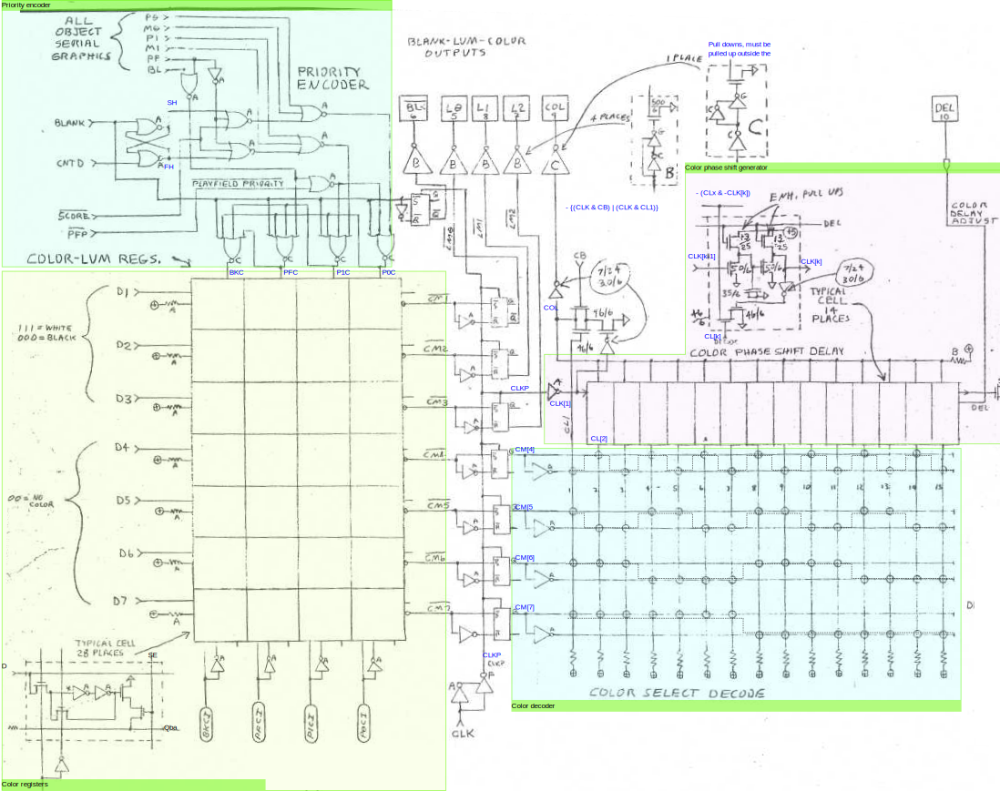

# TIA composite signal generation

[TOC]

## Overview

This section describes the generation of the composite TV signal, starting from the latches pixel graphics of the various visual objects and the corresponding color registers, to emitting the luminance, blanking, sync, and color components of the signal.

Different versions of the TIA chip exists for the NTSC, PAL, and SECAM TV systems. We mostly focus on the NTSC standard. The relevant section is contained in the following figure:

</img>

#### YIQ color space

The NTSC standard uses the YIQ color space. The YIQ color coordinates are obtained from RGB as follows:

1. The luminance component a weighted average of RGB: $Y = 0.30 R + 0.59 G + 0.11 B$.
2. Two color coordinats are computed by subtracting Y from B and R: $(B-Y,R-Y)$.
3. The coordinates are rescaled by factors $(0.493,0.877)$, respectively.
4. The resulting vector is rotated 33 degrees clockwise to obtain the $(Q,I)$ vector.

In matrix notations, these steps can be summarised as:

$$
\begin{bmatrix} Y \\ I \\ Q \end{bmatrix}
=
\begin{bmatrix}
1 & 0 & 0\\
0 & \sin\theta &  \cos\theta  \\
0 & \cos\theta & -\sin\theta \\
\end{bmatrix}
\begin{bmatrix}
1 & 0 & 0\\
0 & 0.493 & 0 \\
0 & 0 & 0.877 \\
\end{bmatrix}
\begin{bmatrix}
1 & 0 & 0\\
-1 & 1 & 0 \\
-1 & 0 & 1 \\
\end{bmatrix}
\begin{bmatrix}
0.30 &  0.59 & 0.11 \\
0 & 0 & 1 \\
1 & 0 & 0 \\
\end{bmatrix}
\begin{bmatrix} R \\ G \\ B \end{bmatrix}
$$

Setting $\theta = - 33/180\pi$, we find the conversion matrices:

$$
\begin{bmatrix} Y \\ I \\ Q \end{bmatrix}
=
\begin{bmatrix}
0.30 &  0.59 &  0.11 \\
0.60 & -0.28 & -0.32 \\
0.21 & -0.52 &  0.32  \\
\end{bmatrix}
\begin{bmatrix} R \\ G \\ B \end{bmatrix},
\quad
\begin{bmatrix} R \\ G \\ B \end{bmatrix}
=
\begin{bmatrix}
1 &  0.96 &  0.62 \\
1 & -0.28 & -0.63 \\
1 & -1.10 &  1.70  \\
\end{bmatrix}
\begin{bmatrix} Y \\ I \\ Q \end{bmatrix}.
$$

## Color registers and priority encoder

At each point in time the latches `PF`, `BL`, `P0`,  `P1`,  `M0`, `M1` contain a bit that tells whether the corresponding visual object is visible or not, causing the corresponding color register to be read and the color displayed.

There are four color registers updated from the data bus while the corresponding strobe `BKCI`, `PFCI`, `P1CI ` or  `P0CI` is on. The registers are read when one of the mutually-exclusive signals `BKC`, `PFC`, `P1C` and `P0C` is on, which causes the *opposite* of the stored bits to be emitted as `CM1not` to `CM7not` . Since these negated bits are pulled up, if no register is read (which occurs during blanking), the default emitted color is 0000000.

Collisions are resolved using a *priority encoder* that set `BKC`, `PFC`, `P1C` and `P0C` as a function of  `PF`, `BL`, `P0`,  `P1`,  `M0`, `M1`  using the following logic:
$$
\begin{aligned}
\mathtt{BKC} &=
\overline{\mathtt{BLANK}} \wedge 
\overline{\mathtt{P0C}} \wedge
\overline{\mathtt{P1C}} \wedge
\overline{\mathtt{PFC}}
\\
\mathtt{PFC} &=
\overline{\mathtt{BLANK}} \wedge 
\overline{\mathtt{P0C}} \wedge
\overline{\mathtt{P1C}} \wedge
(\mathtt{PF} \vee \mathtt{BL})
\\
\mathtt{P1C} &=
\overline{\mathtt{BLANK}} \wedge 
\overline{\mathtt{P0C}} \wedge
\overline{(\mathtt{PF} \vee \mathtt{BL}) \wedge \mathtt{PFP}} \wedge
(\mathtt{P1} \vee \mathtt{M1} \vee (\mathtt{SecondHalf} \wedge \mathtt{SCORE} \wedge \mathtt{PF}))
\\
\mathtt{P0C} &=
\overline{\mathtt{BLANK}} \wedge 
\overline{(\mathtt{PF} \vee \mathtt{BL}) \wedge \mathtt{PFP}} \wedge
(\mathtt{P0} \vee \mathtt{M0} \vee (\mathtt{FirstHalf} \wedge \mathtt{SCORE} \wedge \mathtt{PF}))
\end{aligned}
$$
The `FirstHalf` and `SecondHalf` bits are the outputs of a latch with `BLANK` and `CNTD` as inputs and thus record whether the first or second half of the screen is being generated.

Hence:

* If `BLANK` is on, then no color is selected; otherwise
* If `PFP` (playfield priority) and `SCORE` (score mode) are both off, then the highest priority color is P0/M0, followed by P1/M1, PF/BL, and BK; otherwise
* If `PFP` is on, then the priority is PF/BL, P0/M0, P1/M1, BK; otherwise
* If `PFP` is off and `SCORE` is on, then the playfield is mapped to the same color as P0/M0 in the first half of the screen and to P1/M1 in the second half. So in the first half of the screen the priority is P0/M0/PF, P1/M1, BL, BK, and in the second half P0/M0, P1/M1/PF, BL, BK.

## Composite outputs

### Blank `BLKnot` and synchronization `SYN` outputs

The `BLKnot` output is set to the opposite of `BLANK` (using the same flip-flop type that drives `LMx`, likely to keep delays equalized). `BLANK` is in turn set during the invisible portion of a scanline or during vertical blanking.

The `SYN` signal (shown on sheet 1) is more complicated. During VSYNC, `SYN` is equal to `HS`, whereas when VSYNC is off, `SYN` is equal to the opposite of `HS`.

### Luminance outputs `LMx`

For each generated colour pixel, the 3 luminance bits `CM[1:3]` are emitted directly as the output lines `LM[0:2]` of the TIA (`CM[0]` is ignored).

### Chromaticity output `COL`

In the NTSC standard, color information (hue and saturation) is added to the composite signal by superimposing to the luminance signal a wave  `COL` of variable phase and amplitude. In the resulting `LUM` + `COL` signal, the bias codes for luminance, the phase for hue, and the amplitude for saturation.

In more detail:

- During the *back porch* (invisible part of the scanline), `COL` generates a fixed short sequence of square pulses called **color burst**, which is used as reference for phase and amplitude of the color signal.
- During the visible part of the scanline, `COL` encodes colors by generating pulses with a period equal to a pixel duration, but with variable phase to encode different hues. The TIA can only turn `COL` off entirely to generate a grayscale pixel or set its amplitude to some fixed value (hence saturation cannot be independently controlled). There are however 15 possible phases for `COL`, selected by bits `CM[7:4]` (recall that `CM[1:3]` control the luminance).

The color signal is derived from the TIA clock `CLK` (see below) and thus has frequency of 3.58MHz. This works because this frequency is the frequency of the color carrier according to the NTSC standard. This is why `CLK` is also called *color clock*. The TIA defines pixels to have the same period of this clock and synchronize all its operations to it.

#### Color decoder

The color bits `CM[7:4]` are fed to a decoder matrix, activating one of 15 lines `CL1`, ..., `CL15` using the following matrix:

| Signal | `CM[7:4]` selection logic                                    | Corresponding `CM[7:4]` value |
| ------ | ------------------------------------------------------------ | ----------------------------- |
| `CL1`  | $\neg({\mathtt{CM}}_4 \vee \overline{\mathtt{CM}}_4 \vee\overline{\mathtt{CM}}_6 \vee \overline{\mathtt{CM}}_7)$ | 1                             |
| `CL2`  | $\neg(\overline{\mathtt{CM}}_4 \vee \overline{\mathtt{CM}}_4 \vee\overline{\mathtt{CM}}_6 \vee \overline{\mathtt{CM}}_7)$ | 2                             |
| ...    | ...                                                          | ...                           |
| `C15`  | $\neg(\overline{\mathtt{CM}}_4 \vee {\mathtt{CM}}_4 \vee{\mathtt{CM}}_6 \vee {\mathtt{CM}}_7)$ | 15                            |

Note that only one of `CL[k]` can be active at any time and that none is active if `CM[7:4]`=0.

#### `COL` generation logic

The color signal `COL` is generated using the logic:
$$
\begin{aligned}
\mathtt{COL} 
&= \neg(
(\overline{\mathtt{CLK}}_1 \wedge (\mathtt{CB} \vee \mathtt{CL}_1))
\vee (\overline{\mathtt{CLK}}_2 \wedge \mathtt{CL}_2)
\vee \ldots
\vee (\overline{\mathtt{CLK}}_{15} \wedge \mathtt{CL}_{15})
)
\\
&=
(\mathtt{CLK}_1 \vee \overline{\mathtt{CB}})
\wedge (\mathtt{CLK}_1 \vee \overline{\mathtt{CL}}_1)
\wedge (\mathtt{CLK}_2 \vee \overline{\mathtt{CL}}_2)
\wedge \ldots
\wedge (\mathtt{CLK}_{15} \vee \overline{\mathtt{CL}}_{15})
\end{aligned}
$$
The waveform is thus controller by the signals  `CL[1]` to `CL[15]` are obtained from `CM[7:8]` using the color decoder matrix. Due to the design of the decoder matrix, these signals are mutually exclusive. Furthermore, the signal `CB` , used to generate the color burst pulse, is also mutually exclusive with all of `CL[k]`. The reason is that `CB` is turned on during only during horizontal blanking and the logic controlling `CM[7:8] ` is designed to load zeros into `CL[1]` to `CL[15]` . Hence, the expression can be simplified to
$$
\mathtt{COL}
=
\begin{cases}
0, & \mathtt{CB}=\mathtt{CL}_1=\ldots=\mathtt{CL}_k = 0, \\
\mathtt{CLK}_1, & \mathtt{CL}_1 = 1 \ \text{or}\  \mathtt{CB} = 1, \\
\mathtt{CLK}_2, & \mathtt{CL}_2 = 1,\\
\dots, & \dots,\\
\mathtt{CLK}_{15}, & \mathtt{CL}_{15} = 1. \\
\end{cases}
$$
If `CM[7:4]=0` color pulses are suppressed (except for the color burst) in order to generate a grayscale pixel. Otherwise, `COL` is set to one of the waveforms `CLK[1]` to `CLK[15]`. These waveforms are delayed versions of the reference clock signal `CLK` obtained by feeding the latter to a sequence of fourteen delay modules, called *phase shifters*. The delay modules are tuned by an external potentiometer connected to the pin `DEL` of the TIA, which can thus be used to adjust the color hue. Since `CLK[1]` is exactly equal to `CLK`, the delay is always zero for `CL[1]`=1, which corresponds to `CM[7:4]`=1. Each increment of the colour register `CM[7:4]` should result in a further delay of 24 degrees, for a maximum of 336 when `CM[7:4]`=15.

Hence we see that the `COL` pulses coding for pixel colors are in phase with the color bust (`CLK[1]`) for color `CM[7:4]`=1 and then gradually out of phase with a 180 degree shift at `CM[7:4]`=15. We also see that when `CM[7:4]=0` color pulses are suppressed, corresponding to gray.

The **color burst** signal is emitted at the beginning of the scanline. The burst is turned on by the `CB` line, which is turn turned on during scanline pixels 36-51 (in the invisible part of the scanline and only if VSYNC is off), for a total of 16 cycles right after `HSYNC` goes off (this appears to be a little too long for the NTSC standard, for which ~9 cycles may be more normal; however it seems to be confirmed by the Stella Programmer's Guide).
