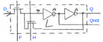

# TIA modules

[TOC]

## Low-level modules

### Follow-hold latch (L)

</img>

The latch module `L` outputs the state `Q` and its opposite `Qnot`. The latch is controlled by the follow line `F` and the hold line `H`. While following, the state is set to the value of the input line `D`; while holding, `Q` is retained and `D` ignored.

`H` should always be the opposite of `F`. If both are low, then `Q` is still retained for some time due to the capacitor. If both are high, then `Q` may be set randomly (todo: check).

This type of latch is used to implement registers: `F` is controlled by the corresponding register strobe line so that the new data is coped into the register when its address is decoded.

<a id="d1"/>

### Dual-phase delay (D1)

</img>

The `D1` module is a delay driven by a dual-phase clock $(\Phi_1,\Phi_2)$: the input `D` is (continuously) copied to capacitor `Q'` while $\Phi_1=1$. The negation of `Q ` is then copied to capacitor `Qnot` while $\Phi_2=1$. The output `Q` is simply  the negation of `Qnot`.

To summarise: the value of `D` sampled at the falling edge of $\Phi_1=1$ appears at `Q` on the following rising edge of $\Phi_2$, where it stays until the next raising edge of the latter.

<a id="d2"/>

### Dual-phase delay with two inputs (D2)

</img>

The `D2` module is the same as `D1`, but has two inputs `D1` and `D2` and the value propagated is `D1 or D2`.

<a id="d1r"/>

### Dual-phase delay with reset (D1R)

</img>

The `D1R` module is the same as `D1`, but it has an additional `R` input which temporarily resets the output to zero: the circuit emits ` delayed(D) and not(R)`. 

### Dual-phase set-reset latch (DL)

</img>

The latch is formed by a combination of `D2` and `D1R` closed in a feedback loop.

If the input `S` (set) is high at the falling edge of $\Phi_1$, the value is propagated to the output `Q` through a delay similar to module `D2`, so `Q` is set (goes high) on the subsequent raising edge of $\Phi_2$. Even if `S` is low at a later falling edge of $\Phi_1$, `Q`  remains set due to the feedback.

The latch is  be reset by raising the `R` (reset) input. This is connected directly to the output, as in `D1R`, so `Q` switches off as soon as `R` goes high. However, the reset is not latched (does not stick) unless `R` is still on at the falling edge of $\Phi_1$.

If both `S` and `R` are on at the falling edge of $\Phi_1$, the set action prevails.

### Flip-flops (F1, F2, F3, FR)

</img>

The `F1` flip-flop outputs its state `Q` and its opposite `Qnot`. The state is set or reset by lowering `Snot` and `Rnot`, respectively. The value of `Snot` and `Rnot` is sampled on the *raising edge* of `CK`. If both `Snot` and `Rnot` are low on the raising edge of `CLK`, then `Q` is set randomly.

Variants `F2` and `F3`  take additional set and reset inputs `Snot1`, `Snot2`, `Rnot1`, `Rnot2` . In this case, the set (reset) condition requires all the set (reset) signals to be asserted (low) at the same time.

The `FR` variant has an additional "immediate" reset input signal `R` which causes the state `Q` to become zero immediately, ignoring the clock.

**Internals.** Flip-flops are implemented by chaining two set-reset latches with enable. For the first one, set-reset inputs are enabled only when `CLK` is low, and for the second one only when `CLK` is high. Hence the output changes only when `CLK` turns high and depends only on the value of the module inputs right before this event occurs (which gives rises to the edge sensitivity).

### Decoders

</img>

The TIA often needs to decode bit strings (match them to particular patterns) in order to trigger various events. Decoders are represented in the schematics as grids with dots at some of the intersections. A dot represents a transistor which is controlled by one of the bit to be tested or by its negation. When the bit is on (off), the corresponding transistor closes and pulls down the vertical line it is connected to (in parallel with other similar transistors controlled by the other bits in the pattern). In this manner, the line is pulled down (which means no match), whenever any of the condition thus expressed is satisfied. Hence, there is only *one* bit pattern that leaves open *all* transistors and thus allows the line to go up, denoting a match. This also means that, in the schematics, dots visually appear to select the negation of the desired pattern. 

## Intermediate modules

### Clock divider

</img>

The CPU clock $\Phi_0$ is generated by a **clock divider module** that takes as input `CLK ` and a reset signal `RESPhi0`. The divider is formed by a chain of *two pairs* of latches. Each pair contains a latch transparent when `CLK` is low followed by a latch transparent when `CLK` is high. Together, each pair forms a flip-flop sensitive to the raising edge of `CLK`. 

Call $Q_1$ and $Q_2$ the outputs of the two flip-flop; the update logic is $Q_1(t+1) \leftarrow \overline{Q_2}(t)$ and $Q_2(t+1) = Q_1(t) \vee \overline{Q_2}(t)$, resulting in the repeating sequence $(Q_1,Q_2)=(1,1),(0,0),(1,0)$. This is not quite enough to shape $\Phi_0$ correctly, as the latter has to be raised for exactly 3/2 of a `CLK` period. In order to do so, the intermediate signal `M1` is extracted from the output of the first latch in the first flip-flop, which is the same as $Q_1$, but updated half a clock earlier. Since $\Phi_0(t) = \overline{Q_2(t) \vee M_1(t)}$[^1] we get to the following table:

|    t    | `CLK` | `Q1` | `Q2` | `M1` | $\Phi_0$ |
| :-----: | :---: | :--: | :--: | :--: | :------: |
| (0,1/2) |   1   |  1   |  1   |  0   |    0     |
| (1/2,1) |   0   |  1   |  1   |  1   |    0     |
| (1,3/2) |   1   |  0   |  0   |  1   |    0     |
| (3/2,2) |   0   |  0   |  0   |  0   |    1     |
| (2,5/2) |   1   |  1   |  0   |  0   |    1     |
| (5/2,3) |   0   |  1   |  0   |  0   |    1     |

The reset signal `RESPhi0` immediately resets the second latch in each FF to $(Q_1,Q_2)=(1,1)$, hence the top row of the table. However, the first latch in each flip-flip is updated only when `CLK`=1. Hence RESET should be maintained until the raising edge of `CLK` to "stick" properly.

[^1]: Note that the PP module driving the $\Phi_0$ output pin is non-inverting.

<a id="dual-phase"/>

### Dual-phase clock generators

</img>

The dual phase clock generator takes as input the clock signal `CLK` and a reset signal `RES` and outputs a the dual-phase clocks $(\Phi_1,\Phi_2)$ and `RESL`, a latched version of `RES`.

The module is sensitive to the raising edge of `CLK`. On the raising edge, the module jumps to the next phase, visiting states $(\Phi_1,\Phi_2)=(0,1),(0,0),(1,0),(0,0)$  (which we call phases $p=0,1,2,3$).

Raising `RES` immediately (and indepently of `CLK`) switches and keeps the state to phase 2. `RES` is also latched and emitted as `RESL`. `RESL` is maintained until the generator reaches phase 0, which requires receiving two raising edges of  `CLK` after `RES` has gone low. `RESL`  is an output used as a reset signal for a counter module (see below).

The generator module is implemented as follows. Its state is stored in two flip-flops $Q_0$ and $Q_1$ sensitive to the raising edge of `CLK`. These are interconected to repeat the sequence of states $(Q_0,Q_1)=(0,0),(1,0),(1,1),(0,1)$. The dual clocks are then derived as $\Phi_1 = \overline{Q_0 \vee Q_1} = \overline{Q_0}\wedge\overline{Q_1}$ and $\Phi_2=Q_0 \wedge Q_1$ , generating the sequence $(\Phi_1,\Phi_2)=(1,0),(0,0),(0,1),(0,0)$.

### Dual-phase counters

**Horizontal counter `HC`**

</img>

**Player counter `PC`**

</img>

**Missile counter `MC`**

</img>

**Ball counter `BC`**

</img>

Visual objects use nerarly-identical internal counters $C$ to keep track of time. Counters use a dual-phase logic so that $C = 4\cdot\mathtt{C} + p$ where $p=0,1,2,3$ is the phase index. $C$, `C` span the range 0-227, 0-56 for the master *horizontal counter* `HC` and 0-159, 0-39 for the other visual objects.

 `C` is implemented as a 6-bit wide polynomial counter $c=(c[5],\dots,c[0])$, cheaper than using a 2-complement register. Incrementing $c$ uses the update equation
$$
c_{t+1} \leftarrow (\overline{c_t[4] \oplus c_t[5]}, c_t[0], \dots c_t[4])
$$
In this manner, starting from 0, the register visits up to 63 distinct values (not 64 as the count value $c=(1,1,1,1,1,1)$ cannot be reached) before wrapping back to 0. Decoding $c$ to a count value thus does not use 2-complement; rather, patterns should be explicitly enumerated and counted. Specifically, the polynomial counter visits the following patterns:

| Count | Pattern `C[5:0]` | Pattern oct |
| ----- | ---------------- | ----------- |
|     0 | `000000`         |  000        |
|     1 | `000001`         |  001        |
|     2 | `000011`         |  003        |
|     3 | `000111`         |  007        |
|     4 | `001111`         |  017        |
|     5 | `011111`         |  037        |
|     6 | `111110`         |  076        |
|     7 | `111101`         |  075        |
|     8 | `111011`         |  073        |
|     9 | `110111`         |  067        |
|    10 | `101111`         |  057        |
|    11 | `011110`         |  036        |
|    12 | `111100`         |  074        |
|    13 | `111001`         |  071        |
|    14 | `110011`         |  063        |
|    15 | `100111`         |  047        |
|    16 | `001110`         |  016        |
|    17 | `011101`         |  035        |
|    18 | `111010`         |  072        |
|    19 | `110101`         |  065        |
|    20 | `101011`         |  053        |
|    21 | `010110`         |  026        |
|    22 | `101100`         |  054        |
|    23 | `011000`         |  030        |
|    24 | `110000`         |  060        |
|    25 | `100001`         |  041        |
|    26 | `000010`         |  002        |
|    27 | `000101`         |  005        |
|    28 | `001011`         |  013        |
|    29 | `010111`         |  027        |
|    30 | `101110`         |  056        |
|    31 | `011100`         |  034        |
|    32 | `111000`         |  070        |
|    33 | `110001`         |  061        |
|    34 | `100011`         |  043        |
|    35 | `000110`         |  006        |
|    36 | `001101`         |  015        |
|    37 | `011011`         |  033        |
|    38 | `110110`         |  066        |
|    39 | `101101`         |  055        |
|    40 | `011010`         |  032        |
|    41 | `110100`         |  064        |
|    42 | `101001`         |  051        |
|    43 | `010010`         |  022        |
|    44 | `100100`         |  044        |
|    45 | `001000`         |  010        |
|    46 | `010001`         |  021        |
|    47 | `100010`         |  042        |
|    48 | `000100`         |  004        |
|    49 | `001001`         |  011        |
|    50 | `010011`         |  023        |
|    51 | `100110`         |  046        |
|    52 | `001100`         |  014        |
|    53 | `011001`         |  031        |
|    54 | `110010`         |  062        |
|    55 | `100101`         |  045        |
|    56 | `001010`         |  012        |
|    57 | `010101`         |  025        |
|    58 | `101010`         |  052        |
|    59 | `010100`         |  024        |
|    60 | `101000`         |  050        |
|    61 | `010000`         |  020        |
|    62 | `100000`         |  040        |

This table can be generated using the following Python program:

```python
C = (False,)*6
count = 0
while True:
    print(('| {:>2}    | `' + '{:d}'*6 + '` |').format(count, *reversed(C)))
    x = not(C[4] != C[5])
    C = (x,) + C[:-1]
    count = count + 1
    if C == (False,)*6: break
```

In order to count up to 56 (resp. 39), an explicit reset signal  `END` is generated when a comparator detects the 56-th (resp. 39-th) pattern. A reset signal `ERR` is generated also for the invalid pattern $c=(1,1,1,1,1,1)$. A third reset signal `RESL`  is obtained from the dual-phase clock generator in response to an external reset signal `RES`. Any of such resets causes $c_{t+1}\leftarrow 0$.

The counters are implemented in dual-phase logic, generated by the corresponding dual-phase clock generator. The latter takes as input `CLK` and `RES` and generates as output $(\Phi_1,\Phi_2)$ and `RESL` as explained [before](#dual-phase-clock-generators). The polynomial counter is implemented as a chain of `D1R` modules realizing a shift register, as follows:

1. A `CLK` raising edge is received, switching to phase  $\Phi_1=1$. During this phase each delay captures a new input value. For example, `c[1]` captures `c[0]`.
2. At the next `CLK` raising edge, $(\Phi_1,\Phi_2)=(0,0)$ and the captured input is maintained.
3. At the next `CLK` raising edge, $\Phi_2=1$ and the captured input is emitted as the output. For example `c[0]` takes the previously-captured value of `c[1]`.
4. At the next `CLK` raising edge, $(\Phi_1,\Phi_2)=(0,0)$ and levels are maintained.

The overall effect is that the counter `C` is updated every four `CLK` pulses with the next value.

**Internal reset.** When the counter `C` reaches its maximum value, the reset signal `END` is generated. This is fed to a D1 delay which causes `R` to raise four `CLK` pulses later. `R` in turn lasts for four `CLK` cycles causing `C` to take the value 0 during this period.

**External reset.** As seen above, soon as `RES` is raised, $(\Phi_1,\Phi_2)=(1,0)$ regardless of `CLK`. Hence, while `RES` is high, `C` is maintained to its current value even if further `CLK` pulses are received. `RESL` is also raised immediately and latched.

Once `RES` is lowered again, further `CLK` pulse resume advancing the counter. Note that there can be a large gap between the two events as some counters are updated only in certain parts of the scanline, but `RES` can be received anywhere. However, since `RESL` has been latched, the counter is still in "reset" mode. The reset signal is presented at the input of delay `DR` which, since $\Phi_1$, captures it. Two `CLK` pulses later, the output `R` of this delay goes high and `RESL` goes low (see above),  with the same result as an internal reset.