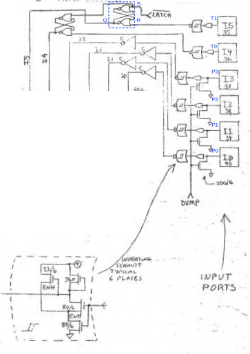

# TIA Ports

[TOC]

</img>

The TIA provides six input ports, `I0-5` to read peripherals such as joysticks and paddles. The first four ports `I0-3` are connected to pins $P0$ to $P3$ and are "dumped", a feature that can be used to read analogues values such as the resistence of potentiometers in paddles. The last two ports `I4-5` are connected to pins $T0$ and $T1$ and are "latched", which allows them to record whether a switch is closed in a certain interval of time.

## Dumped ports `I0-3`

The dumped ports read the TIA pins $P0$ to $P3$ via an [*inverting Schmitt trigger*](https://en.wikipedia.org/wiki/Schmitt_trigger). The data is moved from the triggers to the CPU via inverters, which undoes the inversion applied by the trigger to the input lines. Reading the data is obtained in the same manner as for the other registers, as explained in detail in the [bus and registers](TIA_Bus_Registers.md) section.

In the mother board, pins $P0$ to $P3$ are connected to corresponding RC circuits. By writing to the `DUMP`  registert (a bit in the `VBLANK` register), the CPU can configure the prots to a low-impedance state which discharges the corresponding RC circuits (in this mode the ports work as outputs rather than inputs).

### Reading analogue devices

These features can be used to read the resistance of the potentiometers in the Atari 2600 paddles and similar analogue devices. This is done in three steps:

1. First, the CPU discharges the RC circuits by setting the `DUMP` bit.
2. After a while, the CPU clears the `DUMP` bit, allowing the RC circuits to start recharging. The pull-up recharging resistence is provided by the potentiometer in the paddle or other device, which changes the time constant of the circuit.
3. Then, the CPU polls the TIA (usually once per scanline) to detect how long it takes the RC to recharge. This allows the CPU to measure the time constant and hence infer the value of the potentiometer.

Note that dumping does not *have* to be used and these ports can still be used to read on-off switches.

## Latched ports `I4-5`

The latched ports read lines $T0$ to $T1$, also through an [*inverting Schmitt trigger*](https://en.wikipedia.org/wiki/Schmitt_trigger). The data is moved from the triggers to the CPU via a SR latch. Since the trigger is connected to the reset input `R` of the latch, this undoes the inversion applied by the trigger to the input lines, similar to ports `I0-3`.

In additin to lacking the "dumping" feature, the key difference w.r.t. ports `I0-3` is that these ports are connected to latches. The set input `S` of these latches is connected to `LATCHnot`, another bit in the `VBLANK` register. The effect is as follows:

* While `LATCHnot` is high, the latch operates as a mere inverter.
* While `LATCHnot` is low, the input port operates as an actual latch. The state `Q` remains high until `R` is raised, which in turn occurrs when the input pin `I4` / `I5` goes low (usually in response to closing a switch in a peripheral).

In this manner, the port "remembers" whether the switch is closed at any time aftert `LATCHnot` is taken low.

