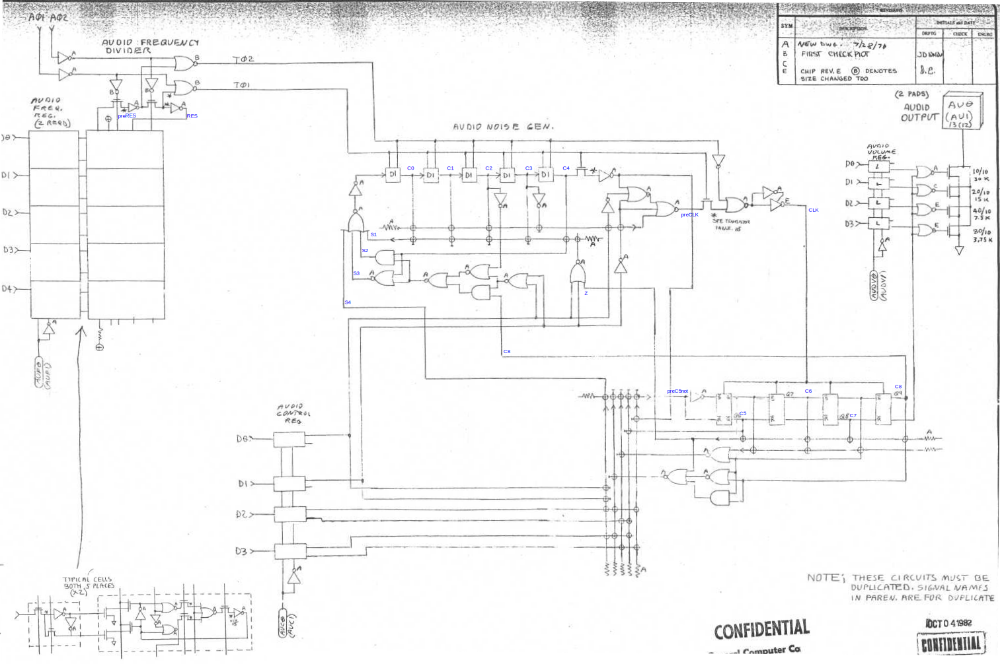

# TIA Sound

[TOC]

## Frequency divider

The TIA sound circuit is driven by the two-phase clock $(A\Phi_1,A\Phi_2)$, generated from the [horizontal counter logic](TIA_Visual_Objects.md) (there are two audio cycles generated for each scanline).

The frequency of the two-phase clock is further divided by a frequency divider, controller by register `AUFx[0:4]`. The frequency divider uses a 5-bit dual-phase counter, formed by cells very similar to the cells used for the generation of [extra clocks](TIA_Visual_Objects.md).

The counter advances by one unit (modulo 32) at each cycle of $(A\Phi_1,A\Phi_2)$, taking a new value when $A\Phi_2=1$ a for any dual-phase logic in the TIA. The counter is compared to the value of `AUFx` and, if there is a match, the signal `RES` is raised, causing the counter to immediately reset.

The `RES` signal is output by a `D1` dual-phase delay and is driven by the intermediate `preRES` signal inside the latter, updated when $A\Phi_1=1$. The `RES` and `preRES` signals are combined with the dua-phase clock to generate the divided dual-phase clock:
$$
T\Phi_1 = A\Phi_1 \wedge \mathtt{RES},\quad
T\Phi_2 = A\Phi_2 \wedge \mathtt{preRES}.
$$
In more detail, the update goes through the following sequence of events:

1. When $A\Phi_2=1$, the counter is incremented. If the the new value matches `AUFx`, the input to the `D1` latch goes high. Unless there was a match in the prior cycle, both `RES` and `preRES` remain low.
2. When $A\Phi_1=1$, `preRES` goes high, but `RES` is stably low. Hence the $T\Phi_1$ pulse is skipped.
3. When $A\Phi_2=1$, `RES` goes high, but `preRES` is stably high. Hence a pulse is generated in $T\Phi_2$. The value of the counter is also immediately set to zero, so the input of the `D1` latch goes low (unless `AUFx`=0).
4. When $A\Phi_1=1$, `preRES` goes low, but `RES` is stably high. Hence a pulse is generated in $T\Phi_1$.
5. When $A\Phi_2=1$, `RES` goes low. Since `preRES` is stably low. Hence the $T\Phi_2$ pulse is skipped.
6. When $A\Phi_1=1$, `preRES` goes low and `RES` is stably low. Hence the $T\Phi_1$ pulse is skipped.

The end result is that pulses in the dual-phase clock $(T\Phi_1,T\Phi_2)$ occurs every `AUFx`+1 cycles (i.e. ,the frequency is divided by `AUFx`+1).

## Audio generator

The divided dual-phase clock $(T\Phi_1,T\Phi_2)$drives two polynomial counters, the (poly5) first spanning bits $C_{0:4}$ and the second (poly4) bits $C_{5:8}$. The first polynomail counter is implemented by five dual-pahse delays, whereas the second by four flip-flop sensitive to the raising edge of a clock signal `ACLK`. The last bit $C_8$ then emitted as audo signal, linearly scaled by the value of the volume register `AUDV[0:3]`.

Updates are controller by the register `AUDC[0:4]` and are given below.

### Poly5 value update

The first bit $C_0$ of the poly5 counter is updated according to the expression:
$$
\begin{aligned}
C_0
\leftarrow
&
[\mathtt{AUC}_{0:3} = 0] + \\
&
([\mathtt{AUC}_{0:1} \not= 0] \cdot C_2 + [\mathtt{AUC}_{0:1} = 0]\cdot C_8) \oplus C_4 + \\
&
([\mathtt{AUC}_{0:1} \not= 0] + [C_{5:8} = 0]) \cdot [C_{0:4} = 0]
\end{aligned}
$$

We can therefore distinguish three cases:

| Control                             | Update to $C_0$                    | Comment                          |
| ----------------------------------- | ---------------------------------- | -------------------------------- |
| `AUC[0:3]`=0                        | 1                                  | Flood with 1                     |
| `AUC[0:3]`$\not=0$ but `AUC[0:1]`=0 | $(C_8 \oplus C_4) + [C_{0:8} = 0]$ | Chain poly5 and poly4 into poly9 |
| `AUC[0:1]`$\not=0$                  | $(C_2 \oplus C_4) + [C_{0:4}=0]$   | 5-bit polynomial counter updates |

When operating as a polynomial counter, $C_{0:4}$ (or $C_{0:8}$ in chained mode) should never become all zero as that is an invalid value for the counter. The purpose of the condition $[C_{0:4}=0]$ (resp. $[C_{0:8}=0]$) is to jump out of this bad state.

### Poly4 clock `ACLK`

The second polynomial clock is the signal $\texttt{ACLK}=T\Phi_2 \wedge D1(X)​$were D1 is a dual-phase delay of the condition
$$
X = 
[\mathtt{AUC}_{0:1}=0,1] + 
[\mathtt{AUC}_{0:1}=2]\cdot [C_{0:4} = 8,24] +
[\mathtt{AUC}_{0:1}=3]\cdot C_4
$$
We can therefore distinguish three cases:

| Control        | `ACLK`         |
| -------------- | -------------- |
| `AUC[0:1]`=0,1 | 1              |
| `AUC[0:1]`=2   | $C_{0:4}=8,24$ |
| `AUC[0:1]`=3   | $C_4$          |

### Poly4 value update

Finally, the first bit of the poly4 is updated as:

$$
\begin{aligned}
C_5 \leftarrow
&[\mathtt{AUC}_{0:3}=0] + \\
&[\mathtt{AUC}_{2:3}=0] \cdot (C_7 \oplus C_8 + [C_{5:8}=0]) + \\
&[\mathtt{AUC}_{2:3}=1] \cdot \overline{C_5} + \\
&[\mathtt{AUC}_{2:3}=2] \cdot C_4 + \\
&[\mathtt{AUC}_{2:3}=3] \cdot (\overline{C_7} + [C_{5:7}=5]).
\end{aligned}
$$

Hence, we can distinguish several cases:

| Control | Update to $C_5$ | Comment |
| ------- | --------------- | ---- |
| `AUC[0:3]`=0       | 1                | Flood with 1 |
| `AUC[2:3]`=0       | $(C_7 \oplus C_8 + [C_{5:8}=0])$             | 4-bit polynomial counter updates |
| `AUC[2:3]`=1       | $\overline{C_5}$               | 0,1,0,1,... wave |
| `AUC[2:3]`=2       | $C_4$          | Chain poly5 and poly4 into poly9 |
| `AUC[2:3]`=3       |   $C_{5:7} = 0,1,2,3,5$   | 0,0,0,1,1,1,... wave |

The function implemented by each such cases is easy to understand except the last one. For that, simply simulate the transitions: $C_{5:7} = 000 (0), 100 (1), 110 (3), 111 (7), 011 (6), 001 (4), 000, ...$. There are two cases that are not included in this list: $010 (2)$,which transitions to $101 (5)$, and $101 (5)$ itself, which transitions to $110 (3)$, where the normal sequences picks up again.

Note also, like before, the $[C_{5:8}=0]$ test to jump out of the bad 4-bit polynomial counter state.

## Stream resampling

In a real-time simulation, the audio signal produced by the TIA needs to be resampled in order to be reproduced by the host hardware due to three reasons:

1. The TIA audio samples are not exactly evenly spaced;
2. The TIA sample frequency is in general different from the host sample frequency; and
3. The simulation speed may vary and deviate from the nominal speed.

The `TIASound` class incorporates a basic resampler with a very simple interface. The assumption is that the host requests a fixed number of samples at a regular intervals (usually called an audio buffer). Resampling then measures how quickly the simulation is advancing in relation to such calls in order to equalize the simulated and host audio streams.

When `TIASound::resample` is called, the simulation rate is estimated by inspecting the number `cycle` of the last simulated Atari 2600. However, due to the fact that the resampling function may be called at slightly different offsets with respect to the host audi buffer period and due to the fact that the simulation advances in bursts, `cycle` is a noisy signal.

In order to obtain a stable estimate of the rate, which is necessary for good reproduction, the signal `cycle` is fed to a smoother. Since `cycle` is a noisy ramp, the function uses a second order [Butterworth filter](https://en.wikipedia.org/wiki/Butterworth_filter) $H(z)$ -- this type of filters has flat response in the pass band, and unit DC gain in particular, so that the output signal is still a ramp with the same slope.1

The design of this filter is carried out in the [resampler iPython notebook](resampler.ipynb).

