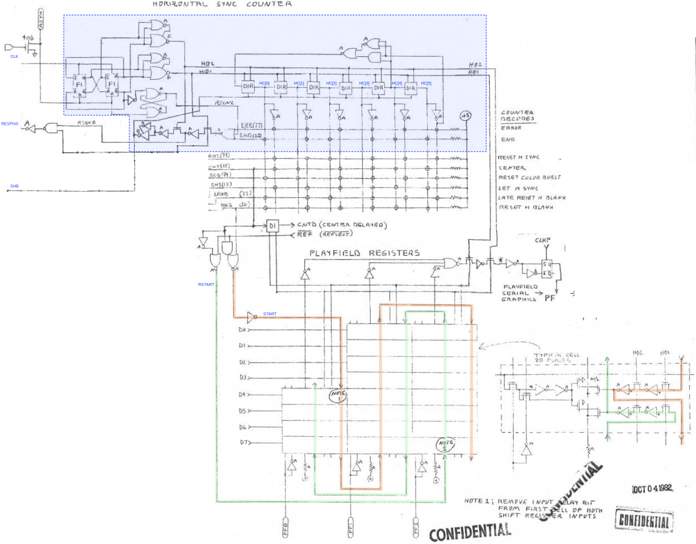
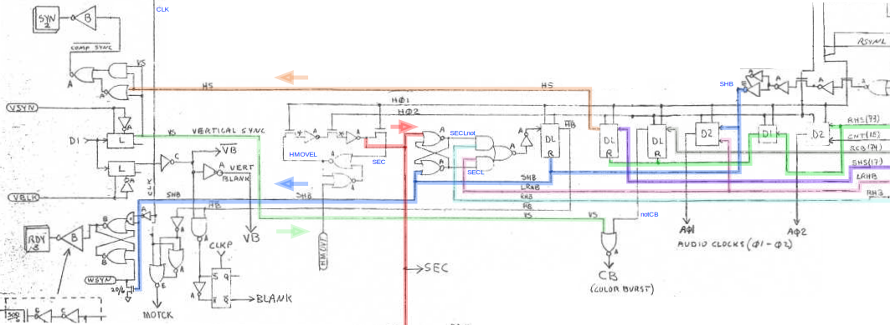
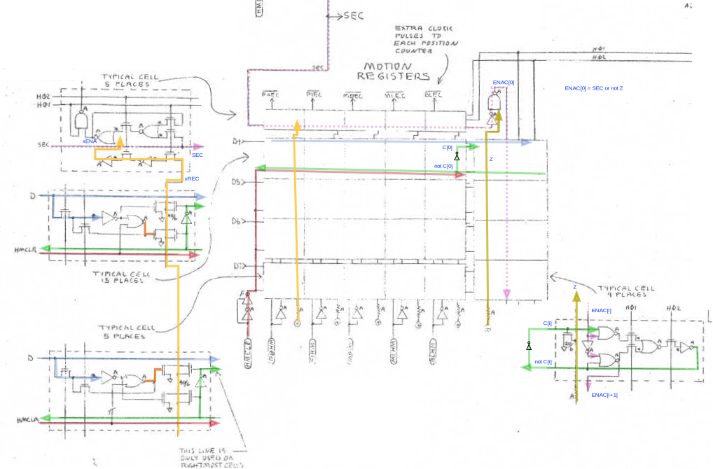
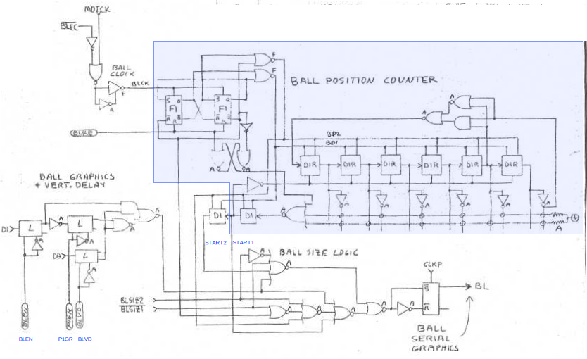
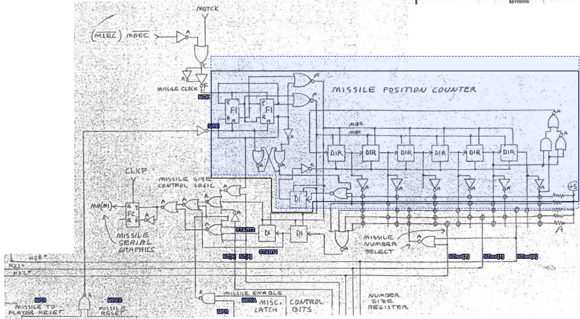
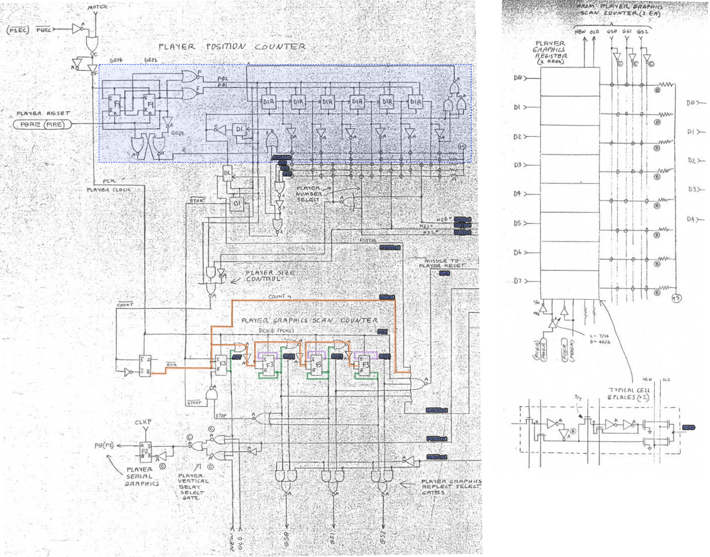
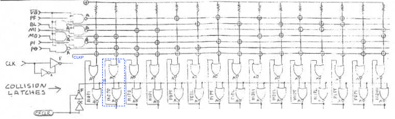

# TIA Visual Objects

[TOC]

The TIA outputs the composite video signal that drives the TV cathode-tube display. Composite video serializes the graphics causing the beam to trace images left to right and top to bottom. To do so, the TIA uses a number of internal counters to time critical events,  such as emitting the intensity and color of each pixel.

The TIA contains several modules, tasked with generating different parts of the graphics: the playfield, the players, the missiles and the ball.

## Basic design of the visual objects

The five TIA visual objects (the playfield, the two players, the two missiles, and a ball) are managed by similar modules. Each modules has:

* An object-specific **pixel latch** (resp. `PF`, `P0`, `P1`, `M0`, `M1` and `BL`) containing the current graphic (which can be either on or off) of the corresponding object. These latches are updated on the raising edge of the same clock signal `CLKP`, 180-degrees out of phase with the main color clock `CLK`. 
* An object-specific **clock signal** `xCP` .  `xCP` is the same ask `CLK` for the playfield and is obtained as the OR  $\mathtt{MOTCK}\vee\mathtt{ECx}$ of the **motion clock**  `MOTCK` and of the object-specific **extra clock**  `ECx` for the other objects.
* An object-specific **dual-phase clock and counter**, driven by the clock  `xCP`  and generating signals the phases $\mathtt{x}\Phi_1$, $\mathtt{x}\Phi_2$ and the counter $\mathtt{xC}$. The dual-phase counter is used to time various object-specific events, such as starting to draw the object graphics.
* An object-specific **reset strobe** `RESx` that resets the dual-phase clock and counter.

For the playfield, the counter `PFC`  has a period of 228 units, equal to the number of `CLK` pulses in a scanline, causing playfield events to repeat identically in each scanline. For for the other objects, the motion clock  `MOTCK` is the same as `CLKP` for the *visibile part of the scanline* and is switched off during horizontal blanks, so this clock emits only YY pulses in a scanline. Thus the corresponding counters `Cx` have period YY.

The question then is why the TIA does not use for all the objects the same clock and counter type that it uses for the playfield. The answer is that this allows implementing a mechanism to *adjust the relative phases* of the object counters with respect to the playfield counter. Since graphic generation is timed using the counters, this in turns allows objects to be shifted left or right on the screen.

Adjusting the counter phases is triggered by hitting the `HMOVE` strobe. This extends the horizontal blanking period for the current scanline by 8 clocks, causing 8 fewer `MOTCK` clock pulses to be produced. This delays the counter updates by 8 and moves all the objects 8 pixels to the right.

Hitting `HMOVE` also triggers the generation of extra clock pulses, which has the opposite effect of anticipating the counter updates. Each visual object has a separate source of up to 15 extra clocks `ECx`, and thus can be shifted independently up to 15 pixels to the left. Minus the 8 pixels right shift caused by extending  the blanking period, this allows to adjust each object position individually by up to 7 pixels to the left and 8 pixels to the right.

> **Remark.** Strobing `HMOVE` should occur at the beginning of a scanline, during the horizontal blanking period. When this occurs, it triggers the generation of extra clocks and increases the duration of the current horizontal blanking period, as just explained.
>
> In practice, `HMOVE` can be strobed at any time, which may or may not cause horizontal blanking to be extended (this depends on the logic explained in this and the following sections) but always triggers the generation of extra clock pulses (unless pulses are already being generated). The latter may or may not have an effect on the visual objects depending on other race conditions described in the next several sections. These details are important as they are exploited by numerous Atari 2600 programming techniques.

## Playfield `PF`

The playfield draws the background graphics. The graphics is stored in three 8-bit registers `PF0-2`; furthermore only the last four bits `PF0[4:7]` of `PF0` are used, encoding 20 pixels worth of graphics. These pixels are scaled up to take four color clocks each; furthermore the pattern is repeated a second time to fill the second half of the scanline, for a total of 160 color clocks. The pattern can be repeated identically or reflected in the second half, depending on the `REFnot` latch.

The playfield serial graphics is controlled by the *horizontal (sync) counter* `HC`, driven as explained before by a dual-phase clock. This counter warrants special mention as it generates many other control signals in addition to the ones relative to the playfield.

The relevant part of the schematics is shown in the figure below:


</img>

 `HC` counts from 0 to 227 before repeating . A decoder compares the counter value to certain trigger values  to generate signals `RHS`, `CNT`, `RCB`, `SHS`, `LRHB` and `RHB` (recall that the binary value stored in `HC[0:5]`should not be interpreted in 2-complement as HC is a polynomial counter -- this is important when studying the decoder matrix). The latter in turn generates several other signals based on the circuit shown below:

</img>


These signals are summarized in the following table. The second column shows the value of  `HC` (0 to 56) and the third the `CLK` periods (0 to 227) during which the corresponding signal is on. The generation logic is summarized using the following notation:

* `D1(X)` and `D2(X, Y)` are a dual-phase delay modules driven by an input `X` or the OR of  two inputs `X` and `Y`, respectively.
* `DL(S, R)` is a dual-phase latch set by `S` (after a a four-clock delay) and reset by `R` (immediately).
* Numbers starting with a zero, such as 017, are in octal notation (unless they are binary strings).

| Signal  | `HC` range | `CLK` period   | Generation logic                                  | Discussion                                                   |
| ------- | ---------- | -------------- | ------------------------------------------------- | ------------------------------------------------------------ |
| `SHB`   | 0          | 0-3            | `D1(END or ERR or RSYNL)`                         | The `SHB` signal is used to set `HB` and clear `HC`.         |
| `HB`    | 0-16 or 18 | 0-67 or 75     | `not DL((SECLnot and RHB or SECL and LRHB), SHB)` | The HBLANK  `HB`  signals (`HBnot` in schematics)  causes the horizontal blanking signal to be emitted in the composite video signal. |
| `BLANK` | 0-16 or 18 | 0-67 or 75     | `HB or VBLK`                                      | `BLANK` turns on blanking, either for horizontal blanking or until `VBLK` is turned on (in which case the timings shown here are ignored). It causes the corresponding signal to be emitted in the composite video output. |
| `SHS`   | 4          | 16-19          | `HC[5:0] == 001.111 (017)`                        | The `SHS` signal is used to set the horizontal sync  `HS` signal and, together with `RHS`, it shapes it. |
| `HS`    | 5-8        | 20-35          | `DL(SHS,D(RHS))`                                  | The `HS` signal helps in the generation of the horizontal sync signal as well as the vertical sync signal. |
| `SYN`   | 5-8*       | 20-35*         | `(VS and HS) or (not(VS) and not(HS))`            | The sync component of the composite video output. It is the same as `HS` if VSYNC `VS` is on and to the opposite otherwise. |
| `APhi1` | 5, 19      | 20-23, 76-79   | `D2(SHS, LRHB)`                                   | Phase 1 of the dual phase clock of the audio circuitry.      |
| `RHS`   | 8          | 32-35          | `HC[5:0] == 111.011 (073)`                        | The `RHS` signal resets the horizontal sync signal `HS` signal and triggers the color burst `CB` signal. |
| `CB`    | 9-12*      | 36-51*         | `(not DL(RCB,D(RHS))) and (not VS)`               | The color burst `CB` signal causes the color burst component of the composite video to be emitted. The color burst is emitted only if `VS` is false, i.e. *not* in VSYNC. |
| `APhi2` | 9, 37      | 36-39, 148-151 | `D2(RHS, CNT)`                                    | Phase 2 of the dual phase clock of the audio circuitry.      |
| `RCB`   | 12         | 48-51          | `HC[5:0] == 111.100 (074)`                        | The `RCB` signal resets the color burst `CB`.                |
| `RHB`   | 16         | 64-67          | `HC[5:0] == 001.110 (016)`                        | The `RHB` signal resets the HBLANK `HB` signal. It can be ignored for `LRHB` depending on the `HMOVEL` latch. |
|         | --         | 68             | --                                                | First visible pixel                                          |
| `LRHB`  | 18         | 72-75          | `HC[5:0] == 111.010 (072)`                        | The `LRHB` signal resets the HBLANK `HB` signal *later*. It can be ignored for `RHB` depending on the `HMOVEL` latch. |
| `CNT`   | 36         | 144-147        | `HC[5:0] == 001.101 (015)`                        | The playfield center signal `CNT` is starts to draw the second part of the playfield. |
| `END`   | 56         | 224-227        | `HC[5:0] == 001.010 (012)`                        | The `END` signal resets the `HC` counter.                    |
| `ERR`   | invalid    | async          | `HC[5:0] == 111.111 (077)`                        | The `ERR` signal resets the `HC` counter.                    |

#### Triggering HMOVE: `SEC` and `SECL`

Since `HMOVE` is a strobe synchronized with bus operations whereas the rest of the relevant logic is synchronized with the horizontal dual-phase clock, the first step is to convert `HMOVE` into a dual-phase pulse `SEC`. This is done as follows.

First, the `HMOVE` signal immediately triggers an asynchronous latch `HMOVEL` . `HMOVEL`  is fed to a dual-phase delay D1 that generates the signal `SEC` . For `HMOVEL` to register, it must occur *before the next falling edge* of phase $H\Phi_1$. This means that the signal is registerd either during the *current* dual-phase clock cycle, or the *next* one, depending on the relative timings. `SEC` then goes high during the dual-phase clock cycle following the one where `HMOVEL` registers.

 `SEC` stays high for the duration of a single dual-clock cycle because during this cycle, at the raising edge of phase $H\Phi_1$, `SEC` is sent back as a reset signal for the  `HMOVEL` latch (there could be a race condition if at this point both `SEC` and `HMOVE` strobe are on, but this seems impossible since the `HMOVE` strobe lasts for around 1.5 clock cycle and `SEC` is sent back to reset the latch with a delay of at least three clock cycles, nor a bus operation can raise `HMOVE` so fast again).

The goal of the pulse `SEC` is to trigger the generation of extra clock pulses, as shown below. It must also cause horizontal blanking to extend beyond normal. Since the termination of horizontal blanking may occur well after `SEC` is generated, this signal is in turn latched as `SECL`  by a SR latch L(`SEC`,`SHB`). This is an asynchronous latch with immediate effect on both of its S and R inputs `SEC` and `SHB`. There is a race condition if `SEC` and `SHB` are triggered at the same time, in which case TODO. This race condition is relevant to some instances of a programming technique known as *late HMOVE*.

The `SECL` latch stays on until the `SHB` reset is received -- which occurs at the beginning of the *next* scanline.

#### Horizontal blanking `HB` 

`HBnot` is driven by a dual-phase latch DL(S,R). The immediate reset signal R is `SHB` , which therefore drives `HBnot` dow immediately at the beginning of a scanline. The delayed set signal S is driven by either `RHB` or `LRHB` depending on whether `SECL` signals that extra clocks are being generated for this scanline, as follows:
$$
(\overline{\mathtt{SECL}} \wedge \mathtt{RHB}) \vee (\mathtt{SECL} \wedge \mathtt{LRHB})
$$
Hence, the behavior is as follows:

* `HB` is set immediately at the beginning of the scanline.
* `HB` is reset with a four color clock delay upon receiving `RHB` if is `SECL` is off while the latter is generated or by `LRHB` is `SECL` is on while the latter is generated.

*Remark:* note that it is possible for `SECL` to change between `RHB` and `LRHB`. However, it can only change in the positive direction (from off to on), which means that in this case `HB` is reset both at `RHB` and `LRHB`, with the second occurrence having effectively no effect in this case.

#### Motion clock `MTOCK`

The motion clock `MTOCK` drives most of the other visual objects. It is generated as
$$
\mathtt{MTOCK} = \overline{\mathtt{CLK}} \wedge \overline{\mathtt{HB}}
$$
It is therefore in opposition of phase with `CLK` and occurs only when horizontal blanking is off (visible part of the scanline). Note that extent of the latter depends on the `SEC` logic, as explain before.

*Remark:* `HB` base clock is `CLK`. Hence, once `HB` turns on or off on a raising edge of `CLK`, there is a half-cycle worth of time before the signal interacts with the next raising edge of not-`CLK`, which allows it to operate cleanly in generating this out-of-phase clock.

### Playfield serial graphic

Playfield graphics are generated by reading individual bits off registers `PF0-2 `, sequentially. The read-out signal in the memory cells implementing such registers is controlled by dual-phase delays (so each bit is read-out for four color cycles, causing each playfield bit to be emitted for four pixels). Read-outs are connected in sequence, so once a bit is done, the next one is read.

There are in fact *two* read-out chains, one scanning bits forward, and the other backward, in order to allow to reflect the graphics. The first read-out signal of these forward and backward chains is respectively given by `START` and `RSTART`, produced as follows:
$$
\mathtt{START} = \mathtt{RHB} \vee (\overline{\mathtt{REF}} \wedge \mathtt{CNT}),
\quad
\mathtt{RSTART} = \mathtt{REF} \wedge \mathtt{CNT}
$$

Hence the forward chain is initiated by `START` when `RHB` goes high (which also last for four color cycles) and again when `CNT` goes high, provided that the playfield is not reflected. Otherwise, `CNT` raises `RSTART` instead, which triggers the reverse chain. The first cells in each direction do not contain delays for their read-outs, so that `START` and `RSTART` are not delayed in causing the respective bits to be read.

As a cell is read, the corresponding bit is fed to another dual-phase delay and eventually to the playfield latch `PF`. Due to this additional delay, it is necessary for `START` to be on four color cycles *before* the first pixel is emitted. Since `RHB` and `CNT` are turned on during pixels 64-67 and 144-147 respectively, this is consistent with the first visible pixel being 68 and the first pixel in the second half of the palyfield being 148.

## Extra clocks

The purpose of the extra clock module is to generate the extra clock needed to shift left the visual objects during an `HMOVE`, producing signals `P0EC`, `P1EC `,  `M0EC`, `M1EC` `BLEC`.

</img>

### Extra clock `xEC`

Each generator cell produces a negated version of the `xEC` clock signal. The latter is equal to $H\Phi_1\wedge\mathtt{xENA}$, where `xENA` is an clock enable signal described below. The important facts about this extra clock is that:

1. Its raining edge is synchronized with the main clock `CLK`.
2. Its high-level phase has a duration equal to a whole `CLK` cycle.

### Extra clock enable `xENA`

 The `xENA` signal enables the clock and is driven by a dual-phase set-reset latch. This latch is:

- Set by `SEC` , generated from `HMOVE`.
- Reset by `xREC` after the desired number of clock pulses have been generated.

Both `SEC` and `xREC` are delayed by the dual-phase clock $(H\Phi_1,H\Phi_2)$. If active simultaneously, `xREC` has priority, making it possible to generate zero extra clocks.

### Extra clock reset `xREC`

The `xREC` signal is in turn obtained by an open-collector decoder by comparing the value stored in the `HMx` register to the clock pulses counter. When the values match, then `xREC` goes high. In more detail, we have
$$
\begin{align}
\mathtt{xREC} &= \neg\left[
(\mathtt{HMx}_0 \wedge \overline{\mathtt{C}_0}) \vee 
(\overline{\mathtt{HMx}_0} \wedge {\mathtt{C}_0}) \vee
\dots \vee
(\mathtt{HMx}_2 \wedge \overline{\mathtt{C}_2}) \vee 
(\overline{\mathtt{HMx}_2} \wedge {\mathtt{C}_2}) \vee
(\overline{\mathtt{HMx}_3} \wedge \overline{\mathtt{C}_3}) \vee 
(\mathtt{HMx}_0 \wedge {\mathtt{C}_3})
\right]
\\
&=
(\mathtt{HMx}_0 \vee \overline{\mathtt{C}_0}) \wedge 
(\overline{\mathtt{HMx}_0} \vee {\mathtt{C}_0})
\wedge \dots
\\
&=
[(\mathtt{HMx}_0 \wedge \mathtt{C}_0) \vee 
(\overline{\mathtt{HMx}_0} \wedge \overline{\mathtt{C}_0})]\wedge\dots
\\
&=
[\mathtt{HMx}_0 = \mathtt{C}_0] \wedge
[\mathtt{HMx}_1 = \mathtt{C}_1] \wedge
[\mathtt{HMx}_2 = \mathtt{C}_2] \wedge
[\mathtt{HMx}_3 = \overline{\mathtt{C}_3}]
\end{align}
$$
Hence `xREC` is set when the counter `C` is equal to the value stored in `HMx` with the last bit flipped (the latter is used because in this manner `HMx[3:0]=0000` generates eight pulses which exactly compensates the delayed `HB` resulting in no overall motion).

### `HMx` registers

There are five `HMx[0:3]` registers containing the required extra clock count for each of the visual objects. They are written immediately from the data buffer `D[4:7]` on receiving the corresponding `xHM` strobe; the `HMCLR` strobe, furthermore, clears all of them in one go, also immediately.

### Extra clock counter `C`

The pulses counter counts the number of extra clock generated so far. It works as a chain four of dual-phase set-reset latches with enable, storing bits `C[0:3]` of the count. Each latch has a signal `ENAC[i]` that enables the set-reset input. The latter are connected as  `S = not C[i]` and `R = C[i]`, so that when `ENAC[i]` is enabled the corresponding bit `C[i]` flips. Enables are chained as `ENAC[i+1] = ENAC[i] & C[i]`, so that bit `C[i+1]` flips only if bits `C[0:i]=1` are all ones.

The exception is `ENAC[0]` which initiates counting. This is set to `SEC or not Z` where `SEC` is the pulse that triggers the count and `Z` is a flag that is one only  if the count `C[0:3]=0` is zero.

The overall effect is that at each cycle of the dual-phase clock the counter is increased by one. Once started, furthermore, the counter keeps going until it wraps back to zero. Furthermore, triggering `SEC` multiple times while the counter is running has no effect. Note that `SEC` itself is driven by dual-phase logic so it is properly "synchronized" with such events.

The absence of possible race conditions in the pulse counter makes it easy to emulate: it suffices to advance the counter at each cycle of the dual-phase clock until it wraps around, starting with the value one with a dual-phase clock delay after `SEC` is received.

## Ball `B`

The ball draws a simple monochrome rectangular region on the screen. The ball module determines when the ball graphics is on or off (the color is determined by a different part of the circuit). The drawing is controlled by a number of internal registers such as `BLEN`, as discussed below.

</img>


### Ball clock

The serialized ball graphic is latched by an edge sensitive flip-flop `BL` on the raising edge of `CLKP`, i.e. with a 180-degree with respect to the main clock `CLK`. The rest of the circuit is driven by the missile clock `BCK`.

The interesting thing about `BCK` is how it is driven in relation to `CLKP`:

- In most cases, `BCK` is the same as `MOTCK`, which is the same as `CLKP` but enabled only during the visible part of the scanline. This means that the flip-flop `BL` latches the graphic computed during the previous cycle of `CLKP` before the new levels are determined.
- During horizontal blanking, `MOTCK` is off. However, in this case `BCK ` can follow `BEC`. The timing of this clock is rather different as its raising edge is in sync with `CLK`, not `CLKP`.  Hence, the levels are updated *before* the flip-flop `M` (still clocked at `CLKP`) latches the graphic.
- In practice, although this is not a standard programming practice, it is possible to drive the TIA to  generate `MOTCK` and `BEC` at the same time. Since they are combined by an OR gate, in theory `BEC` would fill in-between two `MTOCK` pulses, effectively resulting in a pulse of duration 1.5 cycles of `CLK`, deleting a raising edge of `BCK`, as follows (where`^` denotes a raising edge):

```
t-.5   t     t+.5   t+1    t+1.5  t+2    t+2.5  t+3    t+3.5  t+4    t+4.5
+......+......+......+......+......+......+......+......+......+......+......+ BC
^******.......^******.......^******.......^******.......^******.......^******. MOTCK
.......^*************..........................................^*************. BEC
*********************.......^******.......^******.......^********************. Combined
```

In practice, however, `BEC` seems to have sufficient delay to leave a "gap" sufficient for all clocks to still register, as follows:

```
t-.5   t     t+.5   t+1    t+1.5  t+2    t+2.5  t+3    t+3.5  t+4    t+4.5
+......+......+......+......+......+......+......+......+......+......+......+ BC
^******.......^******.......^******.......^******.......^******.......^******. MOTCK
.........^***********............................................^***********. BEC
*******..^***********.......^******.......^******.......^******..^***********. Combined
```

Hence if both `BEC` and `MOTCK` occurs in the same period $[t, t+1)$, then the effect is to anticipate the raising edge of `MOTCK` from $t+0.5$ to $t < t' < t + 0.5$.

### Ball counter

The ball starts drawing when `START1` is raised. Due to the dual-phase logic, this occurs with a delay of four `BCK` cycles from when the counter `BC` reaches the following trigger value:

| Signal   | `NZ[3:0]` value | `BC[5:0]` pattern | `BC` count | Effect        |
| -------- | --------------- | ----------------- | ---------- | ------------- |
| `START1` | any             | 101101            | 39         | Draw the ball |

Note however that `START1` is effectively the same signal as the `BC` counter reset signal. This means that `START1` is triggered *also* by the internal reset signal `RESL`. This causes the ball to start drawing immediately, on the same scanline where the **reset** strobed `BLRE` is received (which is not the case for players and missiles). 

### Ball serial graphics

The ball serial graphic flip-flop `BL` is set according to the following expression:

$$
\mathtt{BLEN} \cdot
\Big\{
  \mathtt{START1} \cdot (
  [\operatorname{phase}(B\Phi)=0] +
  \mathtt{BLSZ}[1] \cdot [\operatorname{phase}(B\Phi)\leq 1] +
  \mathtt{BLSZ}[2]
  ) +
  \mathtt{START2} \cdot (\mathtt{BLSZ}[2:1]=3)
\Big\},
$$

where $\operatorname{phase}(B\Phi)$ is the phase of the dual-phase clock, one of 0,1,2,3 starting with phase 0 corresponding to $(B\Phi_1,B\Phi_2)=(0,1)$.

### Ball minimal state

The state of the ball circuit can be represented in a more compact form, which leads to faster simulation. To find this out, consider the shorthand notation $p = \operatorname{phase}(B\Phi)$,  $S_1 = \mathtt{START1}$, $S_2 = \mathtt{START2}$ and let $s = 2^{\mathtt{BLSZ[2:1]}}$ be the ball size in pixels. Recall that $p=0,1,2,3$ and that $s=1,2,4,8$. Assuming $\texttt{BLEN}=1$, the ball graphics expression can be simplified to
$$
\begin{aligned}
B 
&= S_1 \cdot [p < s] + S_2 \cdot [s = 8] \\
&= S_1 \cdot [p < s] + (S_1 + S_2) \cdot [s = 8].
\end{aligned}
$$

The last equality is obtained because $s=8$ implies $p < s$ since the maximum value of $p$ is 3. Thus we see that $B$ can be computed from the simplified state $(p, S_1, S_1+S_2)$.

We can further rewrite $B$ in terms of a counter $c=0,1,\dots,$11 as follows:
$$
B = [c < s], \quad c = p + 4 \times (S_1 + S_2)\cdot \overline{S_1} + 8 \times (\overline{S_1 + S_2}).
$$
The logic equivalence is easy to check by testing all combinations of $S_1$ and $S_1+S_2$. 

Let $S_1'$ and $S_2'$ be the state internals to the two D1 delays that drive $S_1$ and $S_2$. We show next that a sufficient state representation is given by $(c, S_1')$. In order to do so, we examine the sequence of states traversed starting from a reset signal (e.g. `RESBL`):

| RES    | 1    |      |      |      |      |      |      |      |      |      |      |
| ------ | ---- | ---- | ---- | ---- | ---- | ---- | ---- | ---- | ---- | ---- | ---- |
| $p$    | 2    | 3    | 0    | 1    | 2    | 3    | 0    | 1    | 2    | 3    | 0    |
| $S_1'$ | 1    | 1    | 1    | 1    |      |      |      |      |      |      |      |
| $S_1$  |      |      | 1    | 1    | 1    | 1    |      |      |      |      |      |
| $S_2'$ |      |      |      |      | 1    | 1    | 1    | 1    |      |      |      |
| $S_2$  |      |      |      |      |      |      | 1    | 1    | 1    | 1    |      |
| c      | 10   | 11   | 0    | 1    | 2    | 3    | 4    | 5    | 6    | 7    | 8    |

Upon reset, the phase is set to $p \leftarrow 2$ and $ S_1' \leftarrow 1$. Then, at each clock cycle `BCK` the phase $p$ is incremented by one: when the phase wraps back to 0, $S_1\leftarrow S_1'$ and $c\leftarrow 0$; after this, $c$ is incremented by one until it reaches value 8 again.

The situation is a little more complex if a reset signal is received while $c$ is in one of these intermediate states. The following table shows the effect of raising `RES` starting from each column above:

| RES | 1 | 1 | 1 | 1 | 1 | 1 | 1 | 1 | 1 | 1 | 1 |
| --------- | ---- | ---- | ---- | ---- | ----- | ----- | ----- | ----- | ----- | ----- | ----- |
| $p$      | 2    | 2    | 2    | 2    | 2     | 2     | 2     | 2     | 2     | 2     | 2     |
| $S_1'$ | 1    | 1    | 1    | 1    | 1 | 1 | 1 | 1 | 1 | 1 | 1 |
| $S_1$ |      |      | 1    | 1    | 1     | 1     |      |      |      |      |      |
| $S_2'$ |     |      | 1    | 1 | 1     | 1     |      |      |      |      |      |
| $S_2$ |     |     |      |     |      |      | 1     | 1     | 1     | 1     |      |
| c         | 10 | 10 | 2    | 2    | 2     | 2     | 6     | 6     | 6     | 6     | 8     |

## Missiles `Mx`

The missile draws simple monochrome rectangular graphics on the screen. The missile module is responsible to determine when this graphic is on or off (the color is determined by a different part of the circuit). The drawing is controlled by a number of internal registers such as `NZ`, as discussed below.

</img>

### Missile clock

The serialized missile graphic is latched by an edge sensitive flip-flop `M` on the raising edge of `CLKP`, i.e. with a 180-degree with respect to the main clock `CLK`. The rest of the circuit is driven by the missile clock `MxCK`, which is driven by `MTOCK` and `MxEC` as for the ball.

### Missile counter

The missile starts drawing when `START1` is raised. Due to the dual-phase logic, this occurs with a delay of four `MCK` cycles from when the counter `C` reaches the following values:

| Signal      | `NZ[3:0]` value | `NZ` logic                                                   | `C[5:0]` pattern | `C` count | Effect      |
| ----------- | --------------- | ------------------------------------------------------------ | ---------------- | --------- | ----------- |
| `ST0`/`END` | any             | N/A                                                          | 101101           | 39        | Main copy   |
| `ST1`       | 1,3             | $\mathtt{NZ}_0 \wedge (\overline{\mathtt{NZ}}_0 \vee \overline{\mathtt{NZ}}_2) = \overline{\mathtt{NZ}}_2 \wedge \mathtt{NZ}_0$ | 000111           | 3         | Close copy  |
| `ST2`       | 3,2,6           | $\mathtt{NZ}_1 \wedge (\overline{\mathtt{NZ}}_0 \vee \overline{\mathtt{NZ}}_2)$ | 111101           | 7         | Medium copy |
| `ST3`       | 4,6             | $\mathtt{NZ}_2 \wedge (\overline{\mathtt{NZ}}_0 \vee \overline{\mathtt{NZ}}_2) = \mathtt{NZ}_2 \wedge  \overline{\mathtt{NZ}}_0$ | 100111           | 15        | Far copy    |

The `START1` signal is updated with the expression $\mathtt{ST0}\vee\mathtt{ST1}\vee\mathtt{ST2}\vee\mathtt{ST3}$. Note that when te missile is repositioned by the strobe `RESM` , the counter `C` is set to 0. Since the `ST0`  is generated only at count 39 (to activate `START1` four color cycles later), the missile primary copy is only produced at the next scanline.

### Missile serial graphic

The missile serial graphic latch `M` is set according to the following expression:

$$
(\mathtt{MENA} \cdot \overline{\mathtt{MPRE}}) \cdot
\Big\{
  \mathtt{START1} \cdot (
  [\operatorname{phase}(M\Phi)=0] +
  \mathtt{NZ}[4] \cdot [\operatorname{phase}(M\Phi) \leq 1] +
  \mathtt{NZ}[5]
  ) +
  \mathtt{START2} \cdot (\mathtt{NZ}[5:4]=3)
\Big\}.
$$

When a copy of the object needs to be drawn, `START1` is raised for four `MCK` periods, followed by `START2` for another four period. Each four-cycles period starts with  $\operatorname{phase}(M\Phi)=0$ . Hence, assuming that the graphic is enabled,

| NZ[4:5] | Simplified expression                                        | Missile width |
| ------- | ------------------------------------------------------------ | ------------- |
| 0       | $\mathtt{START1} \wedge [\operatorname{phase}(M\Phi)=0]$      | 1             |
| 1       | $\mathtt{START1} \wedge [\operatorname{phase}(M\Phi)\leq 1]$ | 2             |
| 2       | $\mathtt{START1}$                                            | 4             |
| 3       | $\mathtt{START1} \vee \mathtt{START2}$                          | 8             |

Importantly for simplifying the simulation, `START1`, `START2` and $M\Phi$ are advanced by the dual-phase clock, which in turn is only affected by the clock `MCK`  and the **reset** signal `MRE`. This means that `NUSIZ` or `MENA` can change during drawing of the missile with immediate effect on the generated pixels, but without affecting the timing sequence as such.

### Missile to player reset

Setting `MPR` causes the reset signal `MRE` to raise when the first player copy is drawn (see below). While `MPR` is enabled, furthermore, the missile graphics is disabled. `MPR` is set by the corresponding [player object](#Missile-to-player-reset-MPR).

### Minimal missile state

The same technique to simplify the ball state applies to the missiles.


## Players `P`

The players are also monochrome objects such as the ball and missiles, but they can display 8 bit worth of raster graphics. Hence, their circuitry is significantly more complex.

</img>

### Player timing

#### `START` signal

The player starts drawing when `START` is raised. The latter is generated by a dual-phase delay (hence with a delay of four `PCK` pulses) from any of the four counter `C` conditions `ST0-3` below:


| Signal      | `NZ[3:0]` value | `NZ` logic                                                   | `C[5:0]` pattern | `C` count | Effect      |
| ----------- | --------------- | ------------------------------------------------------------ | ---------------- | --------- | ----------- |
| `ST0`/`END` | any             | N/A                                                          | 101101           | 39        | Main copy   |
| `ST1`       | 1,3             | $\mathtt{NZ}_0 \wedge (\overline{\mathtt{NZ}}_0 \vee \overline{\mathtt{NZ}}_2) = \overline{\mathtt{NZ}}_2 \wedge \mathtt{NZ}_0$ | 000111           | 3         | Close copy  |
| `ST2`       | 3,2,6           | $\mathtt{NZ}_1 \wedge (\overline{\mathtt{NZ}}_0 \vee \overline{\mathtt{NZ}}_2)$ | 111101           | 7         | Medium copy |
| `ST3`       | 4,6             | $\mathtt{NZ}_2 \wedge (\overline{\mathtt{NZ}}_0 \vee \overline{\mathtt{NZ}}_2) = \mathtt{NZ}_2 \wedge  \overline{\mathtt{NZ}}_0$ | 100111           | 15        | Far copy    |

Like the missile, when the player is repositioned by the strobe `RESP` , the counter `C` is set to 0. Since the `START` triggers only occurs at count 39, the missile main copy is only produced with one scanline of delay.

#### `FSTOB` signal

In addition to the `START` signal, the `FSTOB` signal (first object) is generated to differentiate between the main and other copies of the object (the only use of this signal is to implement the missile-to-player reset function).  `FSTOBnot` goes low when the first copy starts and goes high as soon as another copy starts.

In more detail,  `FSTOBnot` is the output of a dual-phase set-rest latch `DL`. It is set as soon as one of the `ST1-3` signals above (non-primary copies) is generated, and it is cleared  as soon as the counter `C` reset signal is generated (i.e. when `ST0` is generated, or the error condition `ERR`, or the reset condition `RESL`).

### Player serial graphics

The player serial graphic latch `P` is updated by reading a sequence of bits from the graphic register `GRP` . The latter uses a **scan counter** `SC` to enumerate the bits. The scan counter is in one of nine states (*inactive*, 0, 1, 2,...,7), with transitions occurring only on (selected) raising edges of the player clock `PCK` , as follows:
$$
\text{inactive}\mapsto
\begin{cases}
0,&\text{if }\mathtt{START}=1,\\
\text{inactive},& \text{otherwise},\\
\end{cases}
\quad
0\mapsto 1,
\quad
1\mapsto 2,
\quad
...,
\quad
6\mapsto 7,
\quad
7 \mapsto \mathrm{inactive}.
$$
When `SC` is in state 0-7, the input to the latch `P` is the corresponding bit of `GRP`; when `SC` is inactive, the input of `P` is low (denoting a transparent pixel). Counting can be slowed down using the `COUNT` logic explained below.

#### `COUNT` logic

The scan counter is stepped only if the signal  `COUNT` is high and remains still otherwise. This allows to skip `PCK` beats in order to create larger copies of the graphics, as specified by bits in the `NZ`  register. `COUNT` is generated by the logic

$$
\mathtt{COUNT} = P\Phi_2 \vee (P\Phi_1 \wedge \overline{\mathtt{NZ}}_1) \vee (\overline{\mathtt{NZ}}_0\vee \overline{\mathtt{NZ}}_2)
$$

which can be unpacked as follows:

| `NZ[2:0]` | `NZ` value  | `COUNT` value          | `COUNT` frequency            | Player width |
| --------- | ----------- | ---------------------- | ---------------------------- | ------------ |
| other     | 0,1,2,3,4,6 | 1                      | Always on                    | Single       |
| 101       | 5           | $P\Phi_1 \vee P\Phi_2$ | On every other  `PCK` period | Double       |
| 111       | 7           | $P\Phi_2$              | On every fourth `PCK` period | Quadruple    |

The value of `COUNT` is inputted to the `ENA` (enable counting) latch, implemented by a flip-flop clocked by `PKC`. Hence it is passed on to the rest of the logic with one `PCK` pulse of delay.

#### `SC` counter logic

The scan counter `SC` is implemented using four `F3` flip-flops "with enable", all updated on the raising edge of `PCK`, one stroring the *active* bit `ACT`  and the three the *count* bits `SC[2:0]` (there are still only nine possible states because $\overline{\mathtt{ACT}} \Rightarrow \mathtt{SC}=0$). The set/reset inputs of such flip-loops are enabled only when a certain chain of conditions are satisfied, otherwise their state does not change. The conditions are as follows:

| Flip-flop | Enabled logic                                                | Set logic            | Reset logic                                                  |
| --------- | ------------------------------------------------------------ | -------------------- | ------------------------------------------------------------ |
| `ACT`     | $\mathtt{ENA}$                                               | $\mathtt{START}$     | $\overline{\mathtt{START}} \wedge (\mathtt{SC}_0 \wedge \mathtt{SC}_1 \wedge \mathtt{SC}_2)$ |
| `SC[0]`   | $\mathtt{ENA}\wedge\mathtt{ACT}$                             | $\neg \mathtt{SC}_0$ | $\mathtt{SC}_0$                                              |
| `SC[1]`   | $\mathtt{ENA}\wedge\mathtt{ACT}\wedge\mathtt{SC}_0$          | $\neg \mathtt{SC}_1$ | $\mathtt{SC}_1$                                              |
| `SC[2]`   | $\mathtt{ENA}\wedge\mathtt{ACT}\wedge\mathtt{SC}_0\wedge\mathtt{SC}_1$ | $\neg \mathtt{SC}_2$ | $\mathtt{SC}_2$                                              |

Hence `SC[0-2]` go through the sequence 0, 1, 2, ..., 7, stepping one place only if `ACT` is enabled. The latter is triggered by `START` and is turned off when `SC[0-7]` reach count 7 (unless `START` is still on, in which case it takes the precedence and another counting cycle starts immediately). All such changes occur on the raising edge of `PCK` and only if `ENA` is set.

#### Missile to player reset `MPR`

The signal `MPR`, which causes the missile to reset to the corresponding player is generated as:
$$
\mathtt{MPR} = \mathtt{MPRE} \wedge \mathtt{ENA} \wedge \mathtt{FSTOB} \wedge \overline{\mathtt{PCK}} \wedge (\mathtt{SC}=1)
$$

The $\overline{\mathtt{PCK}}$ condition means that `MPR` is generated in the second half of the player clock, and the `ENA` and `SC`=1 conditions that the scan counter `SC` just transitioned to value 1 in the *current* player clock. The `FSTOB` signal ensures that reset occurs only for first copy of the player.

#### Pixel logic

The pixel latch `P`, clocked by the raising edge of `PCK`, is updated with the bit of `GRP` pointed to by the scan counter, provided that the latter is in active state.

The scan counter `SC` can be "reflected" to scan the player graphic from right to left instead of left to right. This is done by generating the signal `GS` as follows:

$$
\mathtt{GS}_k = \neg ((\mathtt{SC}_k \wedge \overline{\mathtt{PREFL}}) \vee (\overline{\mathtt{SC}}_k \wedge {\mathtt{PREFL}}))
\quad\Rightarrow\quad
\mathtt{GS}=
\begin{cases}
\mathtt{0b100}-\mathtt{SC}, & \overline{\mathtt{PREFL}}, \\
\mathtt{SC}, & \text{otherwise}.
\end{cases}
$$

The lines `GS` are decoded to 8 `READ[0-7]` signals where `READ[k]` is high exactly when the value of `GS` in 2-complement is $k$. This causes the *opposite* of new/old bits `GRP[GS]`  to be read out from the `GRP` register and put to data lines `NEW` and `OLD`  (see below).

*Remark:* When reflection is off (`PREFL`=0), the first count value `SC`=0 is converted to `GS`=7. Hence pixels emitted from left to right are `GRP[7]`, ..., `GRP[0]`. When reflection is on, pixels are `GRP[0]`, ..., `GRP[7]`.

The pixel latch `P`, clocked by the raising edge of `PCK`, is set by the signal (and reset by the opposite):

$$
\begin{aligned}
P &\leftarrow 
(\neg(\overline{\mathtt{VDELP}} \vee \mathtt{OLD} \vee \overline{\mathtt{ACT}}))
\vee 
(\neg({\mathtt{VDELP}} \vee \mathtt{NEW} \vee \overline{\mathtt{ACT})})
\\
&=
(\mathtt{VDELP} \wedge \overline{\mathtt{OLD}} \wedge {\mathtt{ACT}}))
\vee 
(\overline{\mathtt{VDELP}} \wedge \overline{\mathtt{NEW}} \wedge {\mathtt{ACT}}))
\end{aligned}
$$
Hence we see that `P` is updated as follows:

| Next value of `P`                                            | Condition             |
| ------------------------------------------------------------ | --------------------- |
| 0                                                            | `ACT`=0               |
| $\overline{\mathtt{NEW}} = \mathtt{GRP}_\mathtt{GS}^\text{new}$ | `ACT`=1 and `VLDEP`=0 |
| $\overline{\mathtt{OLD}} = \mathtt{GRP}_\mathtt{GS}^{\text{old}}$ | `ACT`=1 and `VLDEP`=1 |

### Graphic register `GRP`

The graphic registers `GRP` contain eight bits, connected to data lines `D[0-7]` in the obvious manner. Each register contains in fact two copies of the bits, new and old. `GRPnew[k]` is the output of a follow-hold latch controlled by the `P0GRP` strobe (resp. `P1GRP` for the other player) and is connected to the `D[k]` data buffer. `GRPold[k]` on the other hand is controlled by the opposite strobe `P1GRP` (resp. `P0GRP`) and is connected to the value `GRPnew[k]`.

Each cell `GRP[k]` of the graphic register is also driven by a `READ[k]` signal which causes the opposite of `GRPnew[k]` and `GRPold[k]` to be set to lines `NEW` and `OLD`. By construction, only one `READ[k]` is active at any time.

## Collision register `CLX`

</img>

The collision register records any event in which two of the graphic objects were on at the same time. Since there are 6 graphic objects (including the playfield), there are 15=(6 choose 2) of these bits. They are connected to the data bust tri-state buffers to be read off by the CPU.

Each bit is implemented by a set-reset latch. The set signal `S[k]` for the bits are given by the logic

$$
\begin{aligned}
\mathtt{S}_0 &= (\mathtt{P1} \wedge \overline{\mathtt{VB}}) \wedge  (\mathtt{M0} \wedge \overline{\mathtt{VB}}) \wedge \mathtt{CLK} = (\mathtt{P1} \wedge \mathtt{M0}) \wedge \overline{\mathtt{VB}} \wedge \mathtt{CLK}
\\
\mathtt{S}_1 & = (\mathtt{P0} \wedge \mathtt{M0}) \wedge \overline{\mathtt{VB}} \wedge \mathtt{CLK}
\\
\dots &= \dots
\end{aligned}
$$
Hence the first bit checks for a collision between player 1 and missile 0 and so on.

The reset signal `R` is the same for all latches and equal to the `CXCLR` strobe signal. When `S` and `R` are on at the same time, the stored bit is undefined.

There are two notable facts:

* Collisions are detected only when `VBnot` is on, i.e. *not* during vertical blanking. They are however detected during horizontal blanking, for example due to the visual objects being stepped by extra clocks.
* Collision bits are set only when `CLK` raises. Since the pixel latches `PF`, `BL`, ... are updated out of phase, at the raising edge of `CLKP`, this should result in the latches to cleanly set on the raising edge of `CLK`.

## Timing issues

One of the trickiest aspect of emulating the TIA correctly is to get the timing of the various elements right; a tricky example is to judge correctly when strobing/writing to a TIA register is reflected by the hardware in relation to potentially co-occuring drawing events.

In general:

* There are two base sets of clocks, respectively in phase with `CLK` and in opposition of phase with it (e.g. `CLKP`). Flip-flops update their values instantaneously on the rising edge of the corresponding clock.
* Strobes last until $\Phi_2$ is high. Rest strobes connected to dual-phase clock generators cause the corresponding clock to stall during this period.
* Dual-phase logic modules follow their input until the falling edge of $\mathtt{x}\Phi_1$. This is particularly important for those modules whose input is connected to parts of the circuit that *does not* work in dual-phase. A typical example are the `NUSIZ` register which affect the generation of various drawing triggers, processed in dual-phase logic.
* There is an extremely subtle difference in the behavior of the visual objects when clocked by the primary clock `MOTCK` and the extra clocks `ECx` since these are out-of-phase by 180 degree. In particular, it is possible to trigger the TIA to generate extra clock even during the visible part of the scanline, causing `ECx` and `MOTCK` to interfere. In practice, due to the fact that clocks are not *exactly* in opposition of phase, two clock pulse "fuse" to create a slightly anticipated `MOTCK` pulse. The latter updates the graphics of the object *before* the corresponding pixel latch (always clocked on `CLKP`) has a chance to register the previous value, repeating/eliding pixels. This effect is used in some games such as the star field effect in *Cosmic Ark*.

